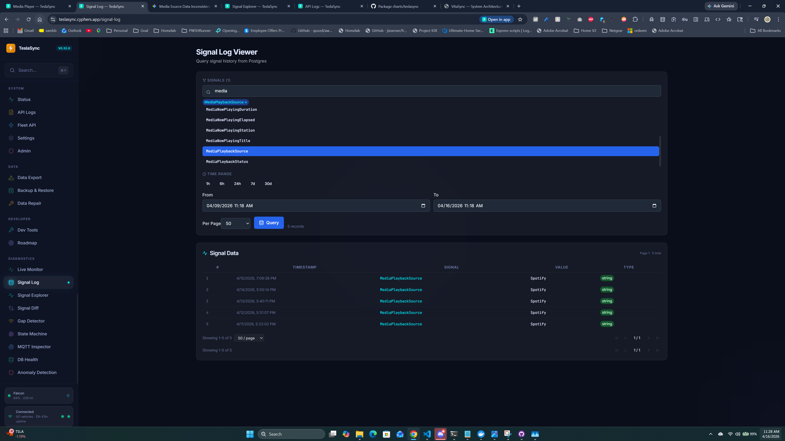
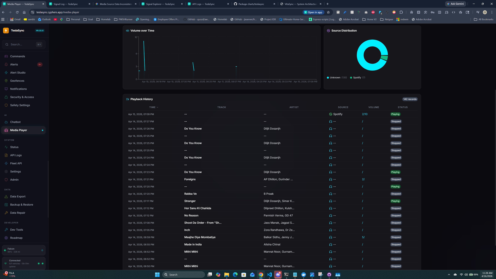

## Issues

1. Issue
The media_snapshots table currently displays fragmented and incomplete data:  

Orphaned Playback Data: Most rows contain track and artist information but are missing the source.

Incomplete Source Entries: We see "source-only" rows that lack track and artist details. These are currently being logged as standalone entries whenever the media source changes, which clutters the table with incomplete records.

Root Cause
The system currently treats signals as isolated events rather than a continuous stream.

Vehicle Signal Behavior: The vehicle broadcasts the MediaPlaybackSource signal only when the source actually changes (e.g., switching from FM Radio to Spotify). It does not re-send the source with every new song.

Logic Gap: Because the backend does not retain the current source state, it cannot associate previous source signals with new incoming track/artist signals.

Proposed Fix: Stateful Signal Integration
We need to implement a mechanism to track the active media state to ensure every database entry is fully populated.

Maintain Active Source State: The service must track the most recently received MediaPlaybackSource signal.

Contextual Mapping: When a new playback signal (containing track and artist) arrives, the service must retrieve the active source state and map it to the new record.

Consolidate Entries: We should avoid creating a new row in media_snapshots for a standalone MediaPlaybackSource signal. Instead, that signal should simply update the "current source" variable. A database entry should only be committed when we have a complete set of data (Source + Track + Artist).

Expected Result
This approach ensures that if a user switches to Spotify and plays 100 songs, we no longer see one empty source row and 100 source-less song rows. Instead, we will see 100 complete records, each containing the correct source, artist, and track name.