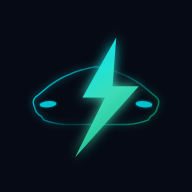
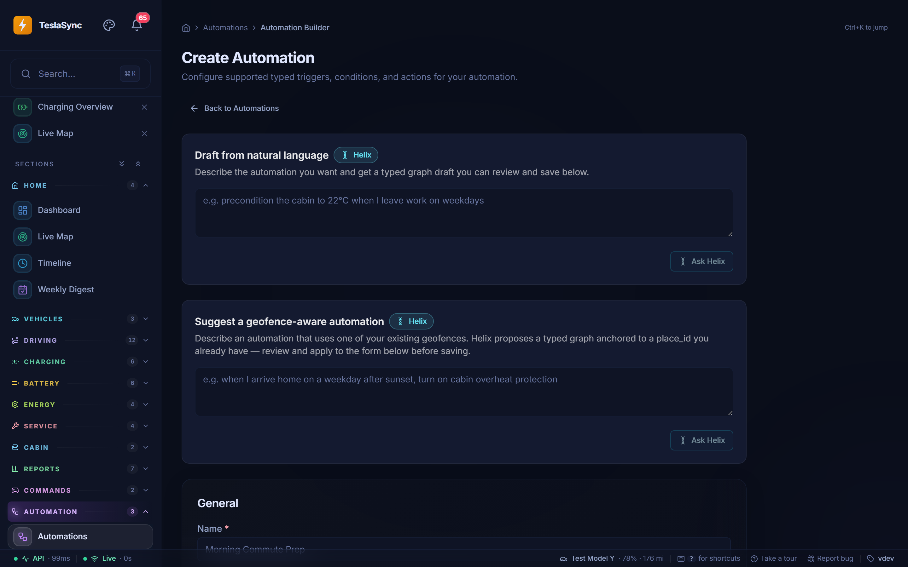
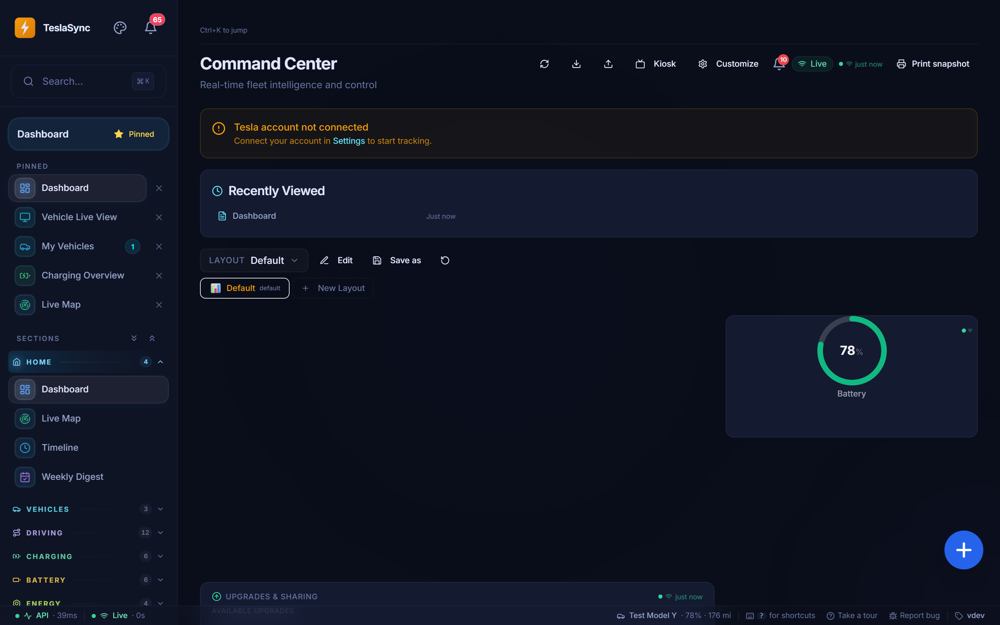
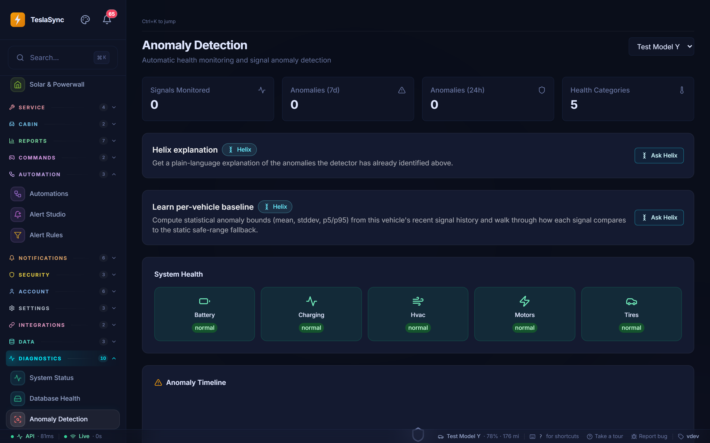

<p align="center">
  
</p>

<h1 align="center">Your Tesla has a story. Own it.</h1>

<p align="center">
  <strong>TeslaSync — open-source Tesla intelligence, on your infrastructure.</strong><br>
  Turn vehicle telemetry into driving insights, charging history, battery trends,<br>
  useful automations, and answers you can explore.
</p>

<p align="center">
  <a href="#quick-start"><strong>Get started</strong></a> ·
  <a href="#see-it-in-action">Screenshots</a> ·
  <a href="#helix-ai">Meet Helix AI</a> ·
  <a href="#for-developers">Build with us</a> ·
  <a href="https://github.com/ev-dev-labs/teslasync/issues">Feedback &amp; ideas</a>
</p>

<p align="center">
  <a href="LICENSE"></a>
  
  
  
</p>

---

## More than a snapshot of your car

What did that road trip cost? How does cold weather affect your efficiency?
Where is your energy going while parked? How has your charging changed over time?

TeslaSync brings the data behind those questions together. Keep a history of
your drives and charging sessions, explore live signals, compare trends, and
create alerts and automations—all from one self-hosted application.

**For Tesla owners:** understand the car you drive every day.

**For homelab enthusiasts:** run your own vehicle data platform with Docker Compose or Helm.

**For developers:** inspect the pipeline, build an integration, or help make Tesla ownership more transparent.

Start with one car. Explore a fleet. Enable the pieces you need.

## What it does

| What you want to know or do | What TeslaSync gives you |
|---|---|
| **Understand every drive** | Drive history, route replay, speed and efficiency analysis, regeneration insights, and trip comparisons. |
| **See where charging money goes** | Session history, charging curves, cost analysis, and charging patterns. |
| **Follow battery and energy trends** | Battery-health views, degradation analysis, parked energy loss, and temperature-impact analytics. |
| **See what is happening now** | Vehicle dashboards, live maps, signal exploration, and browser updates over SSE. |
| **Act on what matters** | Visual alert rules, automation builders, notification channels, cooldowns, and quiet hours. |
| **Control supported vehicle functions** | Charging, climate, locks, schedules, and other Fleet API commands, with a command proxy where signing is required. |
| **Keep your data useful outside the UI** | Exports, backups, REST endpoints, and tools for investigating telemetry. |
| **Ask for help interpreting it** | Optional Helix AI chat, explanations, summaries, and natural-language builders. |

Available signals and commands depend on your vehicle, firmware, region,
Tesla permissions, and deployment configuration. Analytics need recorded
history; a fresh installation will not have months of trends on day one.

## See it in action

<p align="center">
  
  <br>
  <em>Build automations visually, with optional Helix assistance.</em>
</p>

<details>
<summary><strong>Explore the interface: dashboard and diagnostics</strong></summary>

### A workspace for your vehicles



### Investigate signals and anomalies



</details>

These are interface previews from a test installation, not a live demo or
evidence of vehicle health. Screenshots may differ from the current version.

## Why self-host?

Your driving history is personal. So are your locations, routines, and charging habits.

- **Control your storage.** Keep collected history in your own PostgreSQL/TimescaleDB deployment.
- **Choose your integrations.** Configure the map, notification, backup, and AI providers you want to use.
- **Look beneath the charts.** Inspect the source, API, signal history, and diagnostics instead of treating the application as a black box.
- **Make it yours.** Extend the product rather than waiting for a hosted service to expose the feature you need.

Self-hosted does not mean disconnected: Tesla connectivity requires Tesla's
services, and configured external providers may receive data. You control the
deployment and integrations; review their privacy and cost implications.

## Helix AI

**An optional assistant, not a requirement for using TeslaSync.**

Helix adds fleet-aware chat, plain-language explanations, summaries, and
natural-language drafting for things like alerts and automations. Use it to
explore a charging session, investigate an anomaly, or turn an idea into a
draft you can review.

- **Opt in per feature.** AI features are off by default.
- **Choose your provider.** Adapters support OpenAI, Azure OpenAI, Anthropic, and local Ollama.
- **Inspect the work.** Tool activity and per-call audit information help you understand how answers were produced.
- **Stay in control.** Review generated suggestions before applying them. AI output is not a substitute for vehicle diagnostics or professional advice.

Hosted AI providers can incur charges and receive request context. Running a
local model changes the hardware requirements; it does not make the rest of
the Tesla integration offline.

[Explore Helix features, providers, and privacy controls →](docs/guide/helix-ai.md)

## Quick start

### Before you begin

You will need **Git**, **Docker with Compose v2**, and a **Tesla Developer Fleet
API application** with the appropriate permissions. Go and Node.js are not
required on the host for a container-based installation.

Tesla app approval, credentials, and regional API configuration are separate
from installing TeslaSync. Start with the
[Tesla Fleet API setup guide](docs/guide/tesla-fleet-api.md).

### 1. Clone and configure

```bash
git clone https://github.com/ev-dev-labs/teslasync.git
cd teslasync
cp .env.example .env
```

On PowerShell, use `Copy-Item .env.example .env` instead of `cp`.

Edit `.env` with your Tesla application credentials, matching OAuth callback
URL, and deployment settings. Set `WEB_PORT` if port `3000` is already in use.
Keep secrets out of version control.

### 2. Build and start

```bash
docker compose up -d --build
docker compose ps
```

Open **http://localhost:3000**, or the port you configured.

> **Local trial is not a public deployment.** The default Compose setup can run
> without application authentication, and published ports may be reachable from
> other machines. Use a trusted, firewalled environment for a trial. Before
> exposing the application, configure authentication, TLS, strong secrets,
> token encryption, and backups. See the [security policy](SECURITY.md) and
> [deployment guide](docs/deployment/docker.md).

### 3. Connect your Tesla

Open **Settings → Fleet Setup** (`/settings/fleet-setup`) to connect your account,
select a vehicle, choose telemetry signals and intervals, and submit its
subscription. The page also provides wake, configuration removal, and
Tesla-reported telemetry errors.

**Starting the containers alone does not enable vehicle streaming.** Fleet
Telemetry needs the receiver deployed and reachable, a public hostname with
appropriate TLS, and Tesla-side setup. Follow the
[Fleet Telemetry guide](docs/guide/fleet-telemetry.md) for prerequisites and
the `telemetry` Compose profile. Signed commands have their own setup in the
[remote commands guide](docs/guide/remote-commands.md).

**Your first milestone:** connect successfully, confirm data from your selected
vehicle is arriving, then inspect your first recorded drive or charging session.

[Full installation walkthrough →](docs/guide/getting-started.md) ·
[Troubleshooting →](docs/guide/troubleshooting.md) ·
[Kubernetes / Helm →](docs/deployment/kubernetes.md)

## Things worth knowing

**Is it free?**

TeslaSync is MIT-licensed. Hosting, Tesla Fleet API usage, and optional external
providers can have costs. Check Tesla's current
[developer documentation](https://developer.tesla.com/docs/fleet-api) and your
providers' pricing before enabling frequent requests or high-volume integrations.

**Do I need AI?**

No. Telemetry, history, dashboards, and the non-AI tools do not require an AI provider.

**Will every Tesla expose every feature?**

No. Vehicle capabilities, firmware, account permissions, and Tesla's API support
determine what is available. An unavailable signal is not necessarily a setup failure.

**Is this a Tesla product?**

No. TeslaSync is an independent community project, not affiliated with or
endorsed by Tesla, Inc. It complements the official Tesla experience.

**How mature is it?**

TeslaSync is actively evolving. Expect rough edges, back up before upgrades,
and review changes before applying them to a deployment you rely on. Real-world
reports across vehicles and installations are an important part of making it better.

## For developers

**Build something useful with real vehicle data.**

TeslaSync combines a Go backend, a React/TypeScript frontend, and a time-series
data pipeline. You can contribute to one part without having to redesign the whole system.

```text
Tesla vehicle → Fleet Telemetry receiver → MQTT → Go normalization pipeline
                                                      │
                                        ┌─────────────┼──────────────┐
                                        ▼             ▼              ▼
                                   Signal store     Redis       TimescaleDB
                                   local state   shared state     history
                                        └─────────────┬──────────────┘
                                                      ▼
                                                REST + SSE
                                                      ▼
                                               React web app

Tesla Fleet API ← Go API / optional Vehicle Command Proxy
```

| Area | Where to start |
|---|---|
| Frontend features and shared UI | `web/src/features`, `web/src/components` |
| HTTP API | `internal/api` |
| Tesla integration and normalization | `internal/tesla` |
| Live signal state | `internal/signal` |
| Database evolution | `migrations` |
| AI features and tools | `internal/ai` |
| Deployment | `docker-compose.yml`, `helm/teslasync` |

The stack includes PostgreSQL with TimescaleDB, Redis, MQTT, TanStack Query,
and observability through Prometheus, Grafana, and OpenTelemetry.

[Set up local development →](docs/guide/local-development.md) ·
[Architecture →](docs/guide/architecture.md) ·
[API reference →](docs/guide/api-endpoints.md)

## Help shape TeslaSync

**You do not need to write code to make this project better.**

We want TeslaSync to become useful across more vehicles, regions, and homelabs.
Every reproducible bug report, clearer setup instruction, and carefully tested
change helps the next person get further.

- **Try it and tell us where you get stuck.** Setup feedback is especially valuable.
- **Report bugs with context.** Include the version, deployment method, reproduction steps, and sanitized logs. Remove tokens, VINs, and precise locations.
- **Improve the experience.** Help with documentation, translations, accessibility, and mobile layouts.
- **Contribute code.** Tests, integration fixes, telemetry diagnostics, and focused UI improvements are good places to start.
- **Propose a feature before a large PR.** Explain the problem and the workflow you want to improve so we can agree on scope.
- **Help others discover it.** Star the repository, share your experience, and watch releases for updates.

[Open an issue](https://github.com/ev-dev-labs/teslasync/issues) ·
[Read the contribution guide](docs/CONTRIBUTING.md) ·
[Browse releases](https://github.com/ev-dev-labs/teslasync/releases)

For vulnerabilities, **do not post a public issue**. Follow [SECURITY.md](SECURITY.md).

## Documentation

| Run it | Understand it | Extend it |
|---|---|---|
| [Getting started](docs/guide/getting-started.md) | [Fleet Telemetry](docs/guide/fleet-telemetry.md) | [Contributing](docs/CONTRIBUTING.md) |
| [Docker deployment](docs/deployment/docker.md) | [Helix AI](docs/guide/helix-ai.md) | [Local development](docs/guide/local-development.md) |
| [Kubernetes / Helm](docs/deployment/kubernetes.md) | [Remote commands](docs/guide/remote-commands.md) | [Code structure](docs/contributing/code-structure.md) |
| [Configuration](docs/guide/configuration.md) | [FAQ](docs/guide/faq.md) | [Adding features](docs/contributing/adding-features.md) |

## License

[MIT](LICENSE). Use it, study it, modify it, and contribute back.
Third-party components retain their respective licenses.

Built on Tesla's [Fleet API](https://developer.tesla.com/docs/fleet-api),
[Fleet Telemetry](https://github.com/teslamotors/fleet-telemetry), and
[Vehicle Command](https://github.com/teslamotors/vehicle-command), alongside the
open-source projects that make self-hosting possible.

---

<p align="center">
  <strong>Your car. Your history. Your next contribution.</strong><br>
  <a href="#quick-start">Start with TeslaSync</a> ·
  <a href="https://github.com/ev-dev-labs/teslasync">Star the project</a> ·
  <a href="docs/CONTRIBUTING.md">Build with us</a>
</p>
