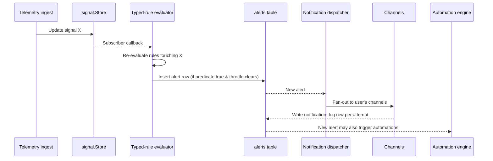

# Alerts & Notifications

Alerts in TeslaSync are not "send me an email when something happens". They are a typed, evaluable contract between the live signal store and the action you want to take. The platform supports the entire lifecycle: authoring the rule, evaluating it against streaming telemetry, throttling delivery, fanning out to multiple channels, recording every attempt, and feeding the result back into automations.

If you want one paragraph: **rules fire when typed predicates over live signals become true; firings become alerts; alerts dispatch via notification channels; everything is audited; Helix can author and tune the rules for you if you opt in.**

## The pieces

| Piece                    | What it is                                                                  | Where it lives                                     |
| ------------------------ | --------------------------------------------------------------------------- | -------------------------------------------------- |
| Alert rule               | Typed predicate + scope + throttle config                                   | `alert_rules` table; UI at **Alert Studio**         |
| Alert (firing)           | An instance of a rule that became true                                      | `alerts` table; UI at **Alerts**                    |
| Notification channel     | A way to deliver an alert (email, push, webhook, Pushover, Discord, etc.)   | `notification_channels` table; UI at **Notifications** |
| Notification log         | One row per delivery attempt with provider response                         | `notification_logs` table                          |
| Automation               | A workflow that reacts to a trigger and runs a chain of actions             | `automations` table; UI at **Automations**          |
| Guard Mode               | A special anti-theft/panic vehicle workflow                                 | `guard_mode_*` tables; UI at **Guard Mode**         |

## Rules are typed, not free-form

TeslaSync does not accept arbitrary JavaScript or JSONPath for rule conditions. Every rule is a typed CTI (Conditional Trigger Intent) contract: a known operator over a known signal with a known parameter shape. The supported operators are documented in the Alert Studio UI itself — they appear in the dropdowns because they're enumerated in code.

Why this matters:

- A typed rule **can** be evaluated against the live signal store with millisecond latency
- A typed rule **can** be statically analysed for conflicts (`cross-rule-conflict-detection` reads the operator AST, not free-form text)
- A typed rule **cannot** be a vector for arbitrary code execution
- A typed rule **cannot** silently break when a signal is renamed — the migration system catches it

The trade-off: you can't write a rule the platform doesn't support. We think that's the right trade-off for an operations-grade platform.

Common rule families:

- **Threshold** — `battery_level < 20`
- **Range** — `inside_temp NOT BETWEEN 5 AND 35`
- **Transition** — `locked changed from true to false outside Home geofence`
- **Duration** — `charging_state == 'Charging' for more than 6 hours`
- **Schedule** — `trigger every weekday at 7:00 am if SoC < 80`
- **Vehicle** — `tpms_pressure_fl < 2.0 bar`
- **Composite** — boolean combinations of the above

## How a rule actually fires



The evaluator runs in-process inside `teslasync-api`. It does not poll. Subscribers are indexed by signal name so a single telemetry write only re-evaluates rules that actually depend on that signal — usually a handful, never thousands.

## Throttling and quiet hours

Alerts without throttling are noise. The platform supports three independent throttling layers:

1. **Per-rule throttle** — minimum time between consecutive firings of the same rule (`min_interval`)
2. **Per-channel rate limit** — maximum messages per minute per channel (prevents waking up Pushover at 03:00)
3. **Quiet hours** — global per-user time windows that downgrade or drop deliveries

Quiet hours are user-configurable in **Notifications → Schedules**. The Helix `quiet-hours-suggestion` feature can propose windows from your delivery history if you opt in.

## Notification channels

The bundled channel implementations all live under `internal/notifications/` and follow a single `Channel` interface (configure, validate, send, healthcheck). The current set:

- **Email** (SMTP)
- **Push** (web push via VAPID)
- **Webhook** (HTTPS POST with HMAC signature)
- **Pushover**
- **Discord**
- **ntfy**
- **Telegram**
- **MQTT republish** (alerts back onto your local broker)

Every send goes through the `notification-worker` binary so a slow channel never blocks the API. Failed sends are retried with exponential backoff and surfaced in `notification_logs` with the provider's error message.

Secrets (SMTP passwords, bot tokens, webhook signing keys) belong in environment variables or Kubernetes secrets — never in the channel config UI, never in docs, never in code. The channel config UI accepts a secret reference (`env:SMTP_PASSWORD`) rather than the literal value.

## Public webhooks

Automations can be triggered from outside TeslaSync via tokenised webhook URLs:

```
POST /api/v1/automations/webhook/{token}
```

These routes bypass ForwardAuth (that's the point — your home-assistant or your phone shortcut wouldn't have a session cookie) but are rate-limited per token and per source IP. Treat the token like a secret; rotate via the automation detail page.

## Where Helix fits

Authoring good rules is hard. Knowing which existing rules are noisy is harder. Helix can do both, opt-in:

- **`nl-alert-builder`** — describe an alert in English ("warn me if the car has been unlocked outside home for more than an hour"), Helix proposes a typed rule scaffold. You review and accept. Helix never persists rules without your confirmation.
- **`alert-tuning-suggestions`** — Helix reads the firing history of each rule and proposes threshold tweaks ("This rule has fired 47 times in 7 days and you've dismissed all but 2 — try raising the threshold from 20 to 15")
- **`cross-rule-conflict-detection`** — flags rules that fire on overlapping conditions ("Rule A and Rule B both trigger on `battery_level < 20` — was that intentional?")
- **`quiet-hours-suggestion`** — proposes quiet-hours windows from your delivery and dismissal patterns

All four read from your already-stored telemetry and rule data. None of them write rules or notification configuration on their own — every Helix-proposed change is gated behind a confirmation step in the UI.

## Guard Mode

Guard Mode is a separate workflow optimised for the security use case. It bundles:

- Sentry-mode awareness (immediate alert on Tesla sentry events)
- Geofence-anchored unlock detection
- Optional auto-record of position trail when an event fires
- Optional cascade: when a Guard event fires, automatically engage sentry on the vehicle, flash lights, and notify a primary contact channel before notifying secondary channels

It is configured in **Guard Mode** as a single per-vehicle setting rather than as a tangle of individual rules — because in a panic scenario you don't want to second-guess whether you wired the rules correctly.

## Troubleshooting

| Symptom                                  | Where to look                                                                 |
| ---------------------------------------- | ----------------------------------------------------------------------------- |
| Rule doesn't fire when I expect it to    | Check the live signal value in **Signal explorer** — the rule sees what the live store sees. If the signal isn't current, see [Live data is stale](/guide/troubleshooting#live-data-is-stale). |
| Rule fires but I get no notification     | Check `notification_logs` for the alert's row. The provider error is recorded there. |
| Notification arrives twice               | Check whether two channels are subscribed to the same alert. Throttle is per-rule, not per-channel. |
| Webhook returns 401                      | Token rotated; regenerate in the automation detail page.                       |
| Guard Mode didn't engage sentry          | Check `command_logs` for the sentry command. If it's missing, the vehicle was probably asleep — see Wake-on-fire setting. |
