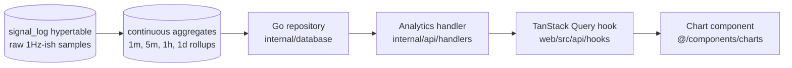

# Analytics & Charts

Analytics is where TeslaSync earns its keep. The platform stores every signal Tesla emits, every drive, every charging session, and every command — and then exposes that history through purpose-built pages that answer specific questions you'd otherwise have to write SQL to answer.

This page covers what's available, how the data flows from the database to the screen, and the rules that keep the charts consistent.

## What you actually get

The analytics surface is large. Rather than list every page, here is the question each section answers:

| Question                                              | Where to go                                         |
| ----------------------------------------------------- | --------------------------------------------------- |
| How efficient was my fleet this month?                | **Analytics → Fleet overview**                       |
| What's my real cost per mile / km?                    | **Analytics → Cost analysis** + **TCO**              |
| Is my battery degrading faster than expected?         | **Battery → Degradation**                            |
| Which cells are dragging down pack health?            | **Battery → Cells**                                  |
| How far can I really go right now?                    | **Battery → Projected range**                        |
| Where am I losing range — heat, cold, speed, regen?   | **Energy → Efficiency** + **Temperature impact**     |
| How well do I drive (and how do I improve)?           | **Driving → Drive score** + **Speed profile**        |
| Did I leave the car asleep efficiently overnight?     | **Energy → Sleep efficiency** + **Vampire drain**    |
| What did I do last week / last year?                  | **Weekly digest** + **Year in Review**               |
| Why does a specific drive look weird?                 | **Drives → drive detail → Anomaly explainer**        |
| Is my Powerwall doing what I think it's doing?        | **Energy → Energy sites**                            |
| Where is a specific signal coming from / going to?    | **Diagnostics → Signal explorer**                    |

There are more pages than the table lists — these are the destination questions. The other pages are usually a deeper view of one of these.

## The data path

Every analytics page follows the same five-step pipeline:

The reason for the layering:

- **Hypertables** hold the raw truth — they grow forever and are the source of recovery
- **Continuous aggregates** are TimescaleDB's incremental materialised views. They make a "30 days of energy" chart load in milliseconds instead of scanning millions of rows
- **Repositories** own the SQL. Handlers never embed SQL inline. This makes it easy to refactor a query without grepping the codebase
- **Hooks** own the cache. A chart never calls `fetch()` directly
- **Chart components** are unit-blind. They receive numbers and a unit hint; the actual display string is produced by the same `useFormatting()` boundary the rest of the app uses

If a chart is slow, the fix is almost always "add a continuous aggregate". If a chart shows the wrong unit, the fix is "use the shared formatter". If a chart breaks on a different timezone, the fix is "pass the user's timezone to `useDateFormat()` rather than calling `toLocaleString()` inside the tick formatter".

## The chart contract

We do not let pages render charts however they want. The shared `@/components/charts` barrel exposes:

- `<ChartContainer>` — handles loading, error, and empty states uniformly
- `<LineChart>`, `<BarChart>`, `<AreaChart>`, `<ScatterChart>`, `<HeatmapChart>` — thin wrappers around Recharts that pin the theme colours and the responsive container
- A small set of axis / tooltip helpers that all defer to `useFormatting()` / `useDateFormat()`

Pages do not import from `'recharts'` directly. The lint rules in `.github/skills/audit-violations/audit.sh` will fail the build if you do. This is the contract that makes "switch the entire app from dark theme to light theme" a single CSS change.

Every chart **must** handle three states:

1. **Loading** — render a `<ChartSkeleton>` of the same height, not a spinner that re-flows the page
2. **Error** — render an inline `<ChartError>` with a retry button, never crash the page
3. **Empty** — render an `<EmptyState>` with one-line context ("No drives in this period"), never a blank rectangle

## Units, dates, currency

This is worth repeating because charts violate it most often:

- The API returns SI: metres, seconds, watts, joules, Kelvin, Pascals, kilograms
- The React layer converts at render time using the user's preferences
- The chart tick formatter, tooltip formatter, and label formatter all receive a number and call `useUnits()` / `useFormatting()`
- A chart with `tickFormatter={(v) => v.toFixed(1) + ' km'}` is a bug. The correct form is `tickFormatter={fmtDistance}` where `fmtDistance` comes from a hook.

The Phase-42 final-gate test suite checks this contract automatically across all known chart pages.

## Where Helix fits

Several analytics surfaces gain an optional Helix layer when you toggle them on in **Settings → Helix**:

- **`anomaly-explanations`** — on the Anomaly Dashboard, Helix writes a paragraph explaining each flagged anomaly using the surrounding telemetry as context
- **`yir-narration`** — Year in Review gets a Helix-written intro and per-section summary
- **`digest-narration`** — Weekly Digest gains a "this week's story" preamble
- **`range-projection-explainer`** — the projected-range model is opaque by default; Helix walks through which factors are driving the current number ("Cold ambient + headwind + 78 km/h average speed cut your projection from 410 to 345 km")
- **`battery-degradation-insights`** — Helix-written commentary on degradation trends, comparing your vehicle against your own history (not against other users — your data never leaves your server unless you've explicitly chosen a cloud provider)

Every Helix call routes through the standard decorator chain (trace → audit → cost → ratelimit → redact). The redactor strips VINs / GPS / driver names before any external provider sees them.

## Grafana

Grafana is included in the default Compose and Helm stacks for operator-grade dashboards that don't belong in the user-facing app — things like database query latency, MQTT message rates, worker queue depths, and SLO burn rates.

Grafana is intended to stay internal. The app pages do not depend on Grafana being publicly reachable; you can lock it behind your VPN and the user app will not notice.

## When to write your own SQL

Sometimes a user-facing chart doesn't exist for the question you have. Three escape hatches:

1. **Signal explorer** lets you plot any signal over any time window in the UI without writing SQL
2. **Data export** can dump drives, charging sessions, signal history, or alert history as CSV / JSON for spreadsheets and notebooks
3. **Grafana** plus direct PostgreSQL access (read-only role recommended) is the right tool for ad-hoc queries you want to dashboard

If you end up doing something useful with one of the escape hatches three times in a row, it probably deserves to be a first-class chart. See [Adding features](/contributing/adding-features).
