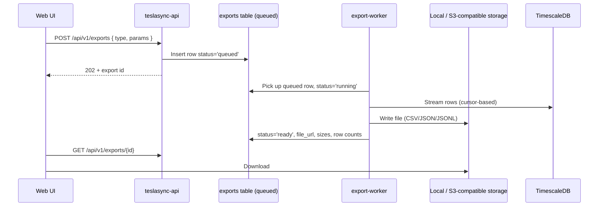

# Data Export

Data export is the answer to "I want this in a spreadsheet" and "I need a JSON dump for my notebook". It is also the safety hatch you'll be glad exists when you switch hosting environments or hand a subset of data to your insurer.

This page covers what you can export, how exports are produced asynchronously, how formats handle units and dates, and the security boundary you should think about before sharing the resulting files.

## What you can export

Every export is scoped to a specific data domain. You can't ask for "everything" in one click — that would produce a multi-gigabyte file most of the time, and it would mix dimensions that don't belong together.

| Domain    | What ships in the file                                                            | Notes                                |
| --------- | --------------------------------------------------------------------------------- | ------------------------------------ |
| Drives    | Drive header + per-sample positions and telemetry (selectable detail level)        | Per-drive or date-range bulk         |
| Charging  | Sessions, per-sample telemetry, Tesla billing rows when present                    | Includes home/Supercharger breakdown |
| Vehicles  | Fleet inventory snapshot + current state                                           | Useful for compliance / inventory    |
| Signals   | Raw signal history (any subset) over a time window                                 | Power user; can get large            |
| Alerts    | Alert history + each notification attempt                                          | For audit / warranty evidence        |
| Analytics | Pre-computed aggregates (daily / monthly summaries)                                | The same numbers the dashboard shows |
| Admin     | API logs, command logs, audit logs                                                 | Restricted to admin users            |

Each export type has its own builder in `internal/exports/` so the producing code knows the exact column set, the unit convention, and the privacy posture for that domain.

## How exports are produced

The naive path — "build the file inside the HTTP handler" — works for small exports and fails badly for large ones. TeslaSync uses an explicit async worker for everything:



The benefits of doing it this way:

- Large exports don't hold an HTTP connection open for minutes
- You can navigate away from the page and come back; the job is in the database, not in your browser
- The worker can be scaled horizontally — multiple `export-worker` pods drain the same queue
- The retry story is sane: a failed export records the error, the row stays queryable, and you can re-run with one click

## Formats

| Format | Best for                                       | Notes                                                       |
| ------ | ---------------------------------------------- | ----------------------------------------------------------- |
| CSV    | Spreadsheets, ad-hoc analysis                  | UTF-8 with BOM so Excel picks it up; ISO-8601 timestamps    |
| JSON   | Small payloads, structured nesting             | Single root object with `meta` + `rows`                     |
| JSONL  | Notebooks, streaming consumers, large datasets | One JSON object per line; safe to `head` / `tail` on Linux  |

CSV is the default for almost every export type because spreadsheets are still the most common consumer. JSONL is the default for "Signals → raw history" because that's the only sensible format for a million-row file.

## Units, dates, currency in exports

This is the question that costs people the most time when they migrate from another platform: **what unit is the number in the file?**

TeslaSync exports honour your user-level preferences. If you display in miles, you get miles. If you display in metric, you get metric. The header column reflects the unit: `range_mi` vs `range_km`, `outside_temp_f` vs `outside_temp_c`.

If you want raw SI without conversion (because your downstream tool will convert), set the `units=si` query parameter on the export request. The header columns then use SI suffixes (`range_m`, `temp_k`, `power_w`).

Date / time columns are always ISO-8601 with the user's timezone offset (`2025-03-14T08:42:11-07:00`). You can override with `tz=UTC` if your downstream tool insists on UTC strings.

Currency columns include both the value and the currency code (`cost_amount`, `cost_currency`) so a multi-currency download stays unambiguous.

## Retention

Generated export files are retained for **30 days by default** then garbage-collected. The metadata row in `exports` is kept indefinitely so you can see what you've exported historically without retaining the files themselves. To re-download an expired export, click "Re-run" — the worker rebuilds it from the source data.

You can tune the retention with `EXPORT_RETENTION_DAYS` (see [Configuration](/guide/configuration)).

## Security boundary

Exports are dangerous in three specific ways. Be aware of them:

1. **VINs and GPS are personal data.** Anyone with the file can plot every place your car has been. Treat exports the way you'd treat your phone's location history.
2. **Tesla tokens are not exported.** We exclude them from every export domain so a leaked dump can't be used to control your vehicle. If you ever see a token in an export, that's a critical bug — file it immediately.
3. **Public share links and exports are different things.** Share links (drive sharing) are tokenised, rate-limited URLs. Exports are files you've downloaded. We control the security of the former; only you control the security of the latter.

For multi-user installations, **export permissions follow the user.** A non-admin user can only export their own vehicles. Admin exports are scoped to the whole instance and are logged in the audit log.

## Helix-assisted redaction (opt-in)

If you've enabled the **`pii-redaction-shared-exports`** Helix feature, the export pipeline gains an extra pass:

- VINs are masked to the last 4
- GPS positions are bucketed to 100 m precision (with full removal as an option)
- Driver names and email addresses inside free-text fields are replaced with `[NAME]` / `[EMAIL]`
- Tesla account display names are replaced with a stable hash

The redaction is opt-in per export type — toggling the feature on doesn't silently strip data from your personal exports; it gives you a "Redact PII" checkbox at export time and runs the pass when you tick it.

## CLI / API usage

If you'd rather script exports than click through the UI:

```bash
# Queue a drives export for the last 30 days
curl -X POST https://teslasync.example.com/api/v1/exports \
  -H 'Cookie: <session>' \
  -d '{"type":"drives","since":"30d","format":"csv","units":"si"}'

# Poll until ready
curl https://teslasync.example.com/api/v1/exports/{id}

# Download
curl -O https://teslasync.example.com/api/v1/exports/{id}/file
```

All export endpoints respect the same auth as the rest of the app — if your deployment uses ForwardAuth, your script needs whatever the proxy expects (typically a long-lived session cookie or a header).

## Troubleshooting

| Symptom                                       | Likely cause                                                                          |
| --------------------------------------------- | ------------------------------------------------------------------------------------- |
| Export stuck at "queued" for more than a minute | `export-worker` not running. Check `docker compose ps` or `kubectl get pods`.        |
| CSV opens in Excel with everything in column A | Locale uses `;` as separator. Use **Data → From Text** and pick comma, or export JSON. |
| Numbers look 1000× off                        | Mixed up units. Check the header column suffix and the `units` query param.            |
| Download returns 404                          | Export was older than retention; re-run from the metadata row.                         |
| Export file contains my Tesla token           | Critical bug — report it. Tokens are not supposed to be in any export type.            |
