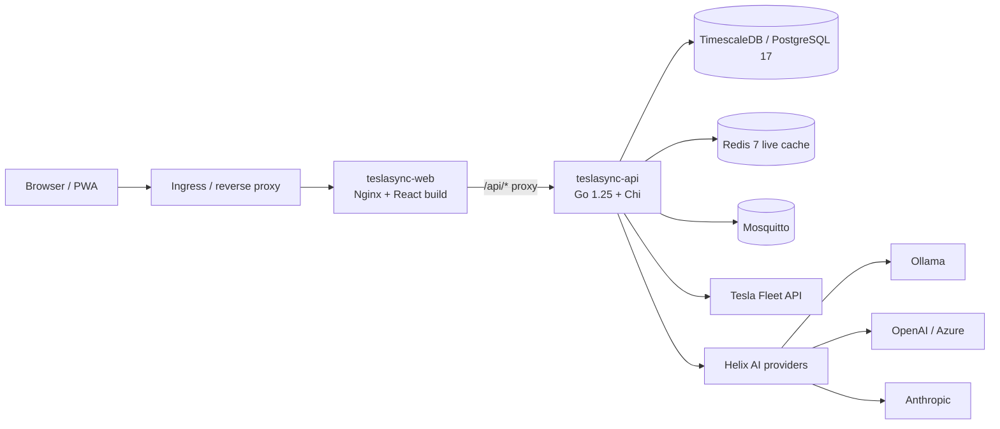
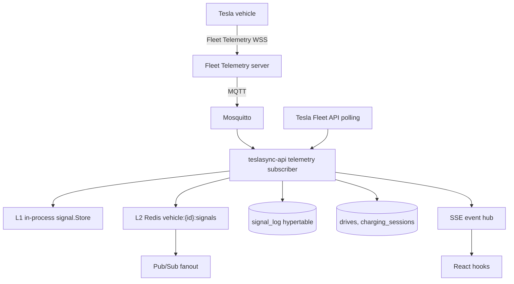
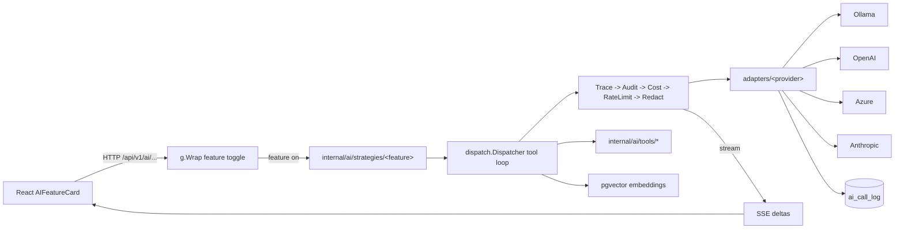
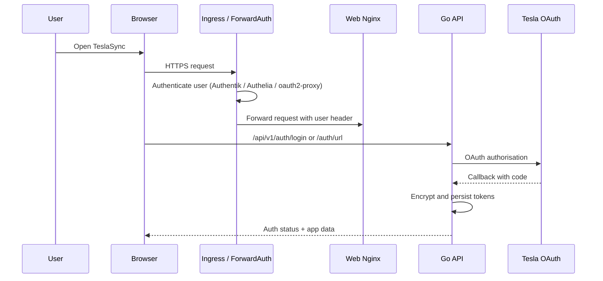
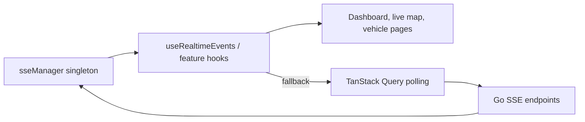
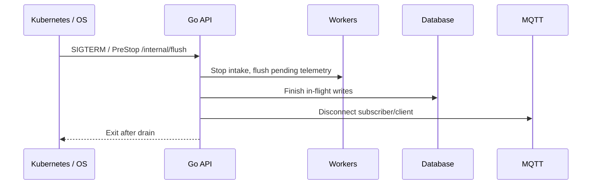

# Architecture

TeslaSync is a self-hosted Tesla fleet platform. The runtime is a Go API plus four worker binaries, a React 18 SPA served behind Nginx, TimescaleDB + Redis + Mosquitto for state, and optional Fleet Telemetry, Vehicle Command Proxy, Ollama, and Jaeger services.

## Production traffic flow

The recommended deployment exposes only the web service publicly. `/api` works because Nginx in the web container proxies to the internal API service through `config.apiEndpoint`.

## Backend services

| Service                       | Binary                            | Responsibility                                                         |
| ----------------------------- | --------------------------------- | ---------------------------------------------------------------------- |
| `teslasync-api`               | `cmd/teslasync`                   | HTTP API, SSE hub, telemetry ingest, Helix AI dispatch, migrations     |
| `notification-worker`         | `cmd/notification-worker`         | Async notification delivery (email, push, webhook, etc.)               |
| `export-worker`               | `cmd/export-worker`               | Background data export jobs                                            |
| `automation-worker`           | `cmd/automation-worker`           | Automation engine execution                                            |
| `vehicle-command-proxy` (opt) | external (Tesla)                  | Signs commands for vehicles that require it (post-2021 Model 3/Y, etc.)|
| `fleet-telemetry` (opt)       | external (Tesla)                  | Receives the WSS stream from vehicles and republishes to MQTT          |
| `ollama` (opt)                | external                          | Local LLM inference for Helix AI                                       |

## Telemetry flow

Fleet Telemetry is the preferred high-frequency path. Polling remains the fallback for setup, commands, refresh, and stale-stream recovery.

The live-signal contract is layered: **L1** is the per-process `signal.Store` for FSM, typed rules, and session evaluation; **L2** is Redis (`vehicle:{id}:signals` HSET + Pub/Sub) for cross-pod reads, restart recovery, and SSE fanout; **`signal_log`** is the durable TimescaleDB hypertable for history. Telemetry ingest is write-through to L1, then L2, then history.

Live reads merge L1 and L2 per signal: the value with the strictly newer non-zero `Timestamp` wins; identical-timestamp ties prefer L2; legacy zero-`Timestamp` values lose to any non-zero timestamp; both-zero ties go to L1. Freshness (`signal.IsLiveSignalFresh`) is informational only — the boundary never silently drops values. `BuildStateFromSignalStore` uses `signal_log.SnapshotAt(now)` as a last-known fallback for fields the live store left at zero (live always wins; the fallback only fills holes after restarts).

## Helix AI flow

Helix AI is wired alongside the API but always **off by default per feature**. Every AI route is wrapped by `g.Wrap("<feature-id>", handler)` in `internal/api/ai_routes.go`, and every React component by `withAiFeature('<feature-id>')`.

See [Helix AI](/guide/helix-ai) for the full strategy + decorator + provider matrix.

## Backend layers

| Layer            | Package area                                       | Responsibility                                                  |
| ---------------- | -------------------------------------------------- | --------------------------------------------------------------- |
| HTTP / router    | `internal/api`                                     | Chi router, middleware, handlers, rate limits, response helpers |
| Database         | `internal/database`                                | pgx pool, repositories, migration runner                        |
| Models           | `internal/models`                                  | JSON/db structs with snake_case JSON tags                       |
| Tesla            | `internal/tesla`                                   | Fleet API client, commands, vehicle-command-proxy routing       |
| Telemetry        | `internal/api/telemetry*`, MQTT packages           | Signal ingest, state flush, session tracking, typed rules       |
| Helix AI         | `internal/ai/{provider,adapters,strategies,tools,dispatch,features,rag,cost,health}` | Provider chain, tool dispatch, feature registry, RAG |
| Workers          | `cmd/*-worker`, `internal/worker`                  | Polling, notifications, exports, automations                    |
| Platform         | resilience, tracing, metrics, crypto               | Circuit breakers, OpenTelemetry, Prometheus, AES-GCM            |

## Frontend layers

| Layer      | Directory                            | Responsibility                                                |
| ---------- | ------------------------------------ | ------------------------------------------------------------- |
| Routes     | `web/src/App.tsx`                    | Lazy-loaded routes wrapped in Suspense + ErrorBoundary        |
| Features   | `web/src/features/*`                 | 21 domain areas; pages + feature-local components             |
| API hooks  | `web/src/api/hooks/*`                | TanStack Query hooks and mutations                            |
| Helix UI   | `web/src/components/ai/*`            | `AIFeatureCard`, `AIThinkingDots`, indicators, panels         |
| Branding   | `web/src/components/branding/*`      | `HelixMark` brand glyph                                       |
| Shared UI  | `web/src/components/{ui,layout,charts,maps,feedback,forms,data-display}/*` | Glass panels, charts, maps, formatters |
| Utilities  | `web/src/lib/*`                      | Formatting, units, resilience, signal catalog, geo helpers    |
| App hooks  | `web/src/hooks/*`                    | SSE, settings, units, shortcuts, virtual lists                |

## Authentication

ForwardAuth protects the main `/api/v1` group when `FORWARD_AUTH_HEADER` is configured. Public token routes (shared drive reports, automation webhooks, Tesla public-key endpoint) bypass auth and use token + rate-limit protection.

## Real-time model

A single shared SSE manager fans out events. Hooks fall back to adaptive polling when the stream is disconnected.

## Graceful shutdown

