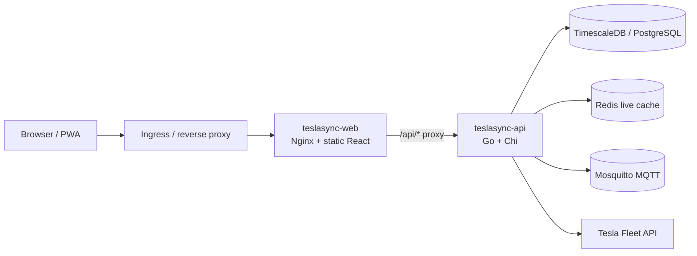
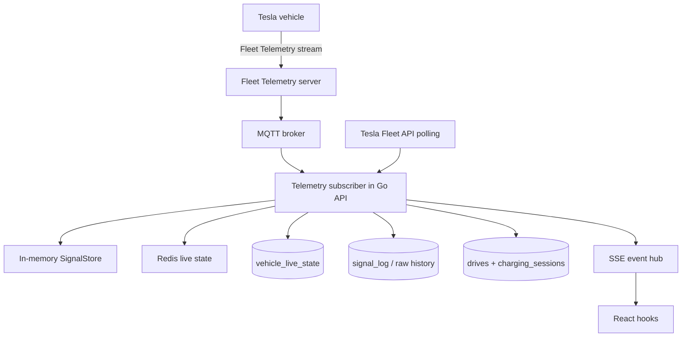
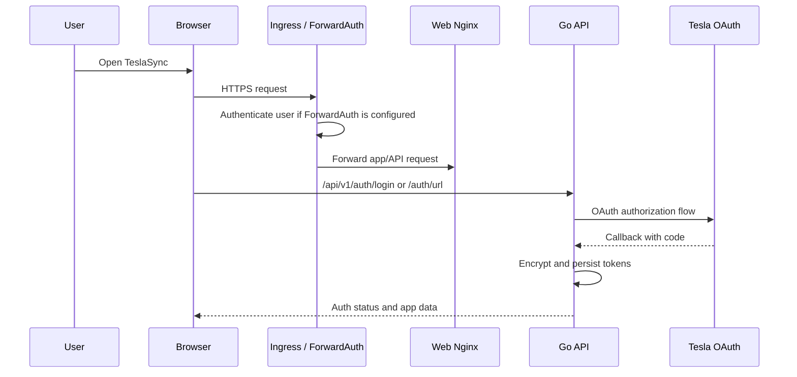
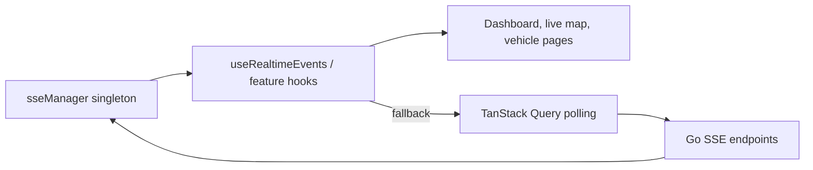

# Architecture

TeslaSync is a self-hosted telemetry platform with a Go API, React SPA, Nginx web proxy, TimescaleDB/PostgreSQL storage, Redis cache, MQTT broker, optional MongoDB raw signal capture, and optional Fleet Telemetry server.

## Request flow

The recommended production path exposes only the web service at the public hostname. `/api` still works because Nginx in the web container proxies to `config.apiEndpoint` on the cluster network.

## Telemetry flow

Fleet Telemetry is preferred for high-frequency state. The current runtime uses both an in-memory SignalStore and Redis: SignalStore is per-process for FSM/CEP/session evaluation, while Redis mirrors live signals for cross-process reads, Pub/Sub fanout, and restart recovery. Polling remains available for setup, commands, refresh operations, and fallback when streaming is stale.

## Backend layers

| Layer | Package area | Responsibility |
|---|---|---|
| HTTP/router | `internal/api` | Chi router, middleware, handlers, rate limits, response helpers |
| Database | `internal/database` | pgx pool, repositories, migrations, query helpers |
| Models | `internal/models` | JSON/db structs with snake_case JSON tags |
| Tesla integration | `internal/tesla` | Fleet API client and command integrations |
| Telemetry | `internal/api/telemetry*`, MQTT packages | Signal ingestion, state flushing, session tracking, CEP evaluation |
| Workers | `internal/worker`, worker commands | Polling, notifications, exports, automations |
| Platform | resilience, tracing, metrics, crypto | Circuit breakers, OpenTelemetry, Prometheus, encryption |

## Frontend layers

| Layer | Directory | Responsibility |
|---|---|---|
| Routes | `web/src/App.tsx` | Lazy-loaded route declarations wrapped in Suspense + ErrorBoundary |
| Features | `web/src/features/*` | Domain pages and feature-local components |
| API hooks | `web/src/api/hooks/*` | TanStack Query hooks and mutations |
| Shared UI | `web/src/components/*` | UI, layout, charts, maps, feedback, forms, data display |
| Utilities | `web/src/lib/*` | formatting, units, resilience, signal catalog, exports, geospatial helpers |
| App hooks | `web/src/hooks/*` | SSE, settings, page title, shortcuts, virtual lists, notifications |

## Authentication model

ForwardAuth protects the main `/api/v1` group when `FORWARD_AUTH_HEADER` is configured. Public token routes such as shared drive reports and automation webhooks use token/rate-limit protection.

## Frontend real-time model

The browser should not create one EventSource per component. The shared manager fans out events and hooks fall back to adaptive polling when the stream is disconnected.

## Graceful shutdown

