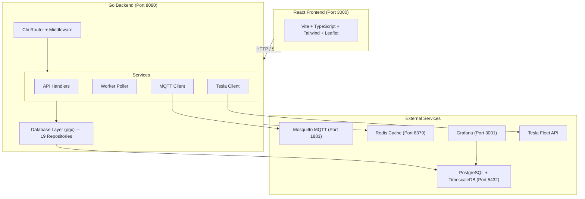
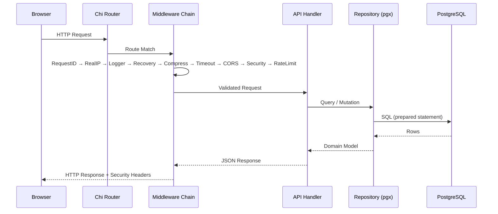
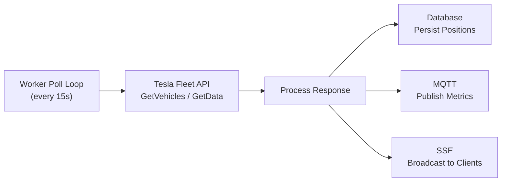
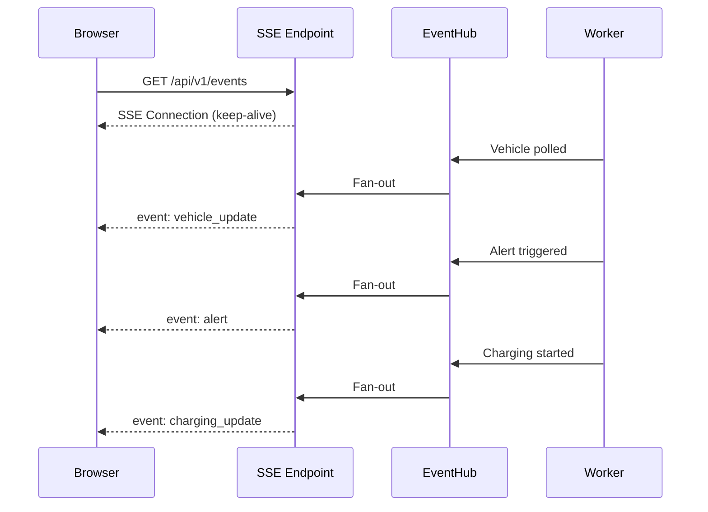
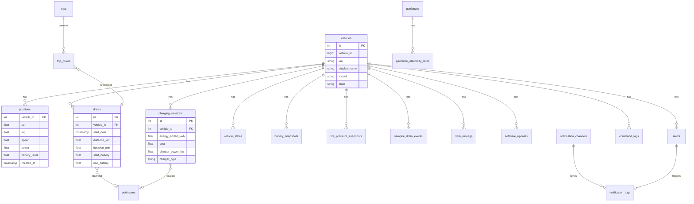
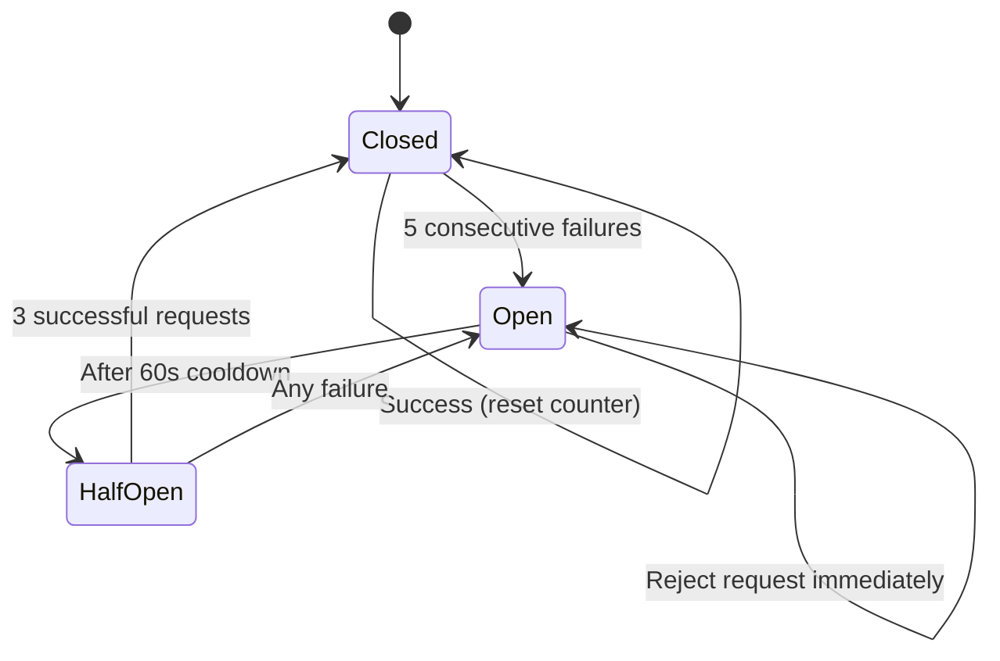
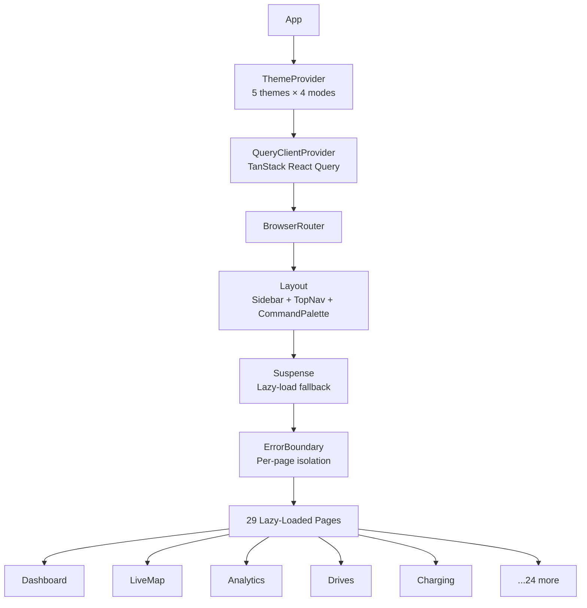
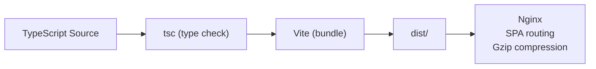

# Architecture

TeslaSync follows a clean, modular architecture with clear separation between the API layer, business logic, data access, and external integrations.

## High-Level Overview



## Component Architecture

### Backend Components

The Go backend is organized into well-defined packages under `internal/`:

```
internal/
├── api/          # HTTP handlers, middleware, routing
├── config/       # Environment-based configuration
├── database/     # PostgreSQL repositories (data access layer)
├── models/       # Domain models and types
├── mqtt/         # MQTT telemetry publisher
├── resilience/   # Circuit breaker, health checks
├── tesla/        # Tesla Fleet API client
└── worker/       # Background polling and maintenance jobs
```

### Request Flow

A typical API request flows through these layers:



### Middleware Stack

The middleware chain is applied in order, wrapping each request:

1. **RequestID** — Assigns a unique ID to each request for tracing
2. **RealIP** — Extracts the real client IP from proxy headers
3. **Logger** — Structured JSON logging with zerolog (method, path, status, duration)
4. **Recovery** — Catches panics, logs stack trace, returns 500
5. **Compress** — Gzip compression at level 5
6. **Timeout** — 30-second request deadline
7. **CORS** — Cross-origin resource sharing (configurable origins)
8. **Security Headers** — X-Content-Type-Options, X-Frame-Options, HSTS, CSP
9. **Rate Limiting** — 100 requests per minute per IP (httprate)

## Data Flow

### Vehicle Polling Loop

The worker continuously polls the Tesla Fleet API for vehicle data:



**Polling behavior:**
- **Active vehicles:** Polled every `WORKER_POLL_INTERVAL` (default 15s)
- **Sleeping vehicles:** Polled at `interval × WORKER_SLEEP_POLL_MULT` (default 60s)
- **Failed polls:** Exponential backoff with circuit breaker protection
- **Self-healing:** Automatically recovers when the Tesla API becomes available

### Real-Time Updates (SSE)

Server-Sent Events provide real-time updates to connected browsers:



The `EventHub` pattern broadcasts events to all connected clients using goroutines. Each client gets its own channel, and the hub fans out events to all subscribers.

### MQTT Telemetry

MQTT provides a lightweight pub/sub interface for integrating with home automation systems:

```
Topic Structure:
  teslasync/vehicles/{VIN}/battery_level    → 85
  teslasync/vehicles/{VIN}/rated_range      → 320
  teslasync/vehicles/{VIN}/latitude         → 37.7749
  teslasync/vehicles/{VIN}/longitude        → -122.4194
  teslasync/vehicles/{VIN}/speed            → 0
  teslasync/vehicles/{VIN}/power            → -1.2
  teslasync/vehicles/{VIN}/inside_temp      → 21.5
  teslasync/vehicles/{VIN}/outside_temp     → 18.2
  teslasync/vehicles/{VIN}/is_charging      → false
  teslasync/vehicles/{VIN}/is_locked        → true
  teslasync/vehicles/{VIN}/sentry_mode      → true
  teslasync/vehicles/{VIN}/vehicle_data     → { full JSON }
```

## Database Design

### TimescaleDB Hypertables

The `positions` table is a TimescaleDB hypertable, which automatically partitions data by time for efficient range queries:

```sql
-- Created in migration 001
SELECT create_hypertable('positions', 'created_at');
```

This means queries like "get positions for vehicle X between date A and B" are extremely fast, even with millions of rows.

### Schema Overview



### Data Retention

A background maintenance worker periodically cleans up old data:

- **General data** (drives, charging, etc.): Retained for `DATA_RETENTION_DAYS` (default 365)
- **GPS positions:** Retained for `POSITION_RETENTION_DAYS` (default 90)

## Resilience Patterns

### Circuit Breaker (Tesla API)

The Tesla API client uses the Sony gobreaker circuit breaker to prevent cascading failures:



### Health Monitoring

Four components are continuously monitored:

| Component | Check Method | Interval |
|-----------|-------------|----------|
| `database` | `SELECT 1` with 5s timeout | 60s |
| `mqtt` | Connection status | 60s |
| `tesla_api` | Circuit breaker state | 60s |
| `worker` | Goroutine alive check | 60s |

Degraded components are logged as warnings and reported via `/api/v1/system/status`.

### Graceful Shutdown

On receiving SIGINT or SIGTERM, TeslaSync performs an ordered shutdown:

1. Cancel the root context (signals all goroutines to stop)
2. HTTP server: 30-second drain period for in-flight requests
3. Close database connection pool
4. Disconnect MQTT client
5. Stop worker goroutines

## Frontend Architecture

### Component Hierarchy



### State Management

- **Server state:** TanStack React Query (automatic caching, refetching, deduplication)
- **Real-time state:** `useRealtimeEvents` hook with SSE auto-reconnect
- **UI state:** React `useState` / `useReducer` (local component state)
- **Theme state:** React Context with localStorage persistence

### Build Pipeline



Vite produces an optimized SPA bundle with:
- Code splitting (per-route lazy loading)
- Tree shaking (unused code elimination)
- Asset hashing (cache busting)
- Gzip-ready output
