# Architecture

TeslaSync follows a clean, modular architecture with clear separation between the API layer, business logic, data access, and external integrations.

## High-Level Overview

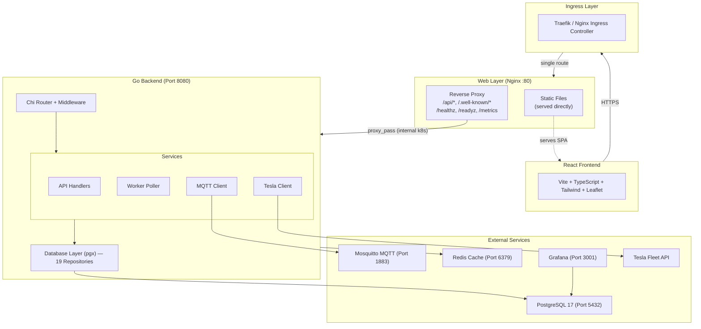

### Traffic Flow

All external traffic enters through a **single ingress route** pointing to `teslasync-web` (Nginx). Nginx serves dual roles:

1. **Static file server** — Serves the React SPA (`/index.html`, `/assets/*`) directly from the container filesystem.
2. **Reverse proxy** — Forwards API paths (`/api/*`, `/.well-known/*`, `/healthz`, `/readyz`, `/metrics`) to `teslasync-api:8080` over the internal Kubernetes cluster network.

```
Browser → Traefik/Ingress → teslasync-web (Nginx)
                              ├── static files: served directly
                              ├── /api/*: proxy_pass → teslasync-api:8080 (internal k8s)
                              ├── /.well-known/*: proxy_pass → teslasync-api:8080
                              ├── /healthz, /readyz, /metrics: proxy_pass → teslasync-api:8080
                              └── teslasync-api → Tesla Fleet API (outbound only)
```

**Why this architecture?**
- **Internal API traffic** — After the initial page load through the ingress, all subsequent API calls from the browser go to Nginx, which proxies them to the API pod over the cluster network. API traffic never traverses the ingress controller.
- **Fewer ingress rules** — A single route simplifies configuration and reduces potential misrouting (e.g., the old `PathPrefix('/api')` matching frontend routes like `/api-logs`).
- **Homelab-friendly** — Most homelab clusters run a single Traefik instance. Keeping API traffic internal avoids overloading the ingress controller.

The `config.apiEndpoint` Helm value controls the Nginx `proxy_pass` target (internal K8s routing). The `config.browserApiBase` controls what URL the browser uses for API calls — leave it empty (default) so the browser uses relative paths through Nginx. If left empty, `apiEndpoint` auto-derives as `http://<release>-api:<port>`.

## Component Architecture

### Backend Components

The Go backend is organized into well-defined packages under `internal/`:

```
internal/
├── api/            # HTTP handlers, middleware, routing, SSE EventHub, CEP rule engine
├── cache/          # Redis + in-memory cache abstraction
├── config/         # Environment-based configuration
├── crypto/         # AES-256-GCM encryption for data at rest
├── database/       # PostgreSQL repositories, places cache, DBTX transactions
├── events/         # Domain event bus (MQTT-backed)
├── export/         # Export worker — async data export & backup processing
├── geocoding/      # Multi-provider reverse geocoding (Google, Azure, Nominatim)
├── metrics/        # Prometheus metric declarations (CEP, SSE, core)
├── models/         # Domain models and types
├── mqtt/           # MQTT telemetry publisher
├── notification/   # Notification worker & channel senders
├── resilience/     # Circuit breaker, health checks
├── signal/         # In-memory SignalStore with DB flush (per-vehicle signal map)
├── backup/         # Backup processor and storage provider abstraction
├── tracing/        # OpenTelemetry tracer initialization and span helpers
├── tesla/          # Tesla Fleet API client
└── worker/         # Background polling and maintenance jobs
```

### Request Flow

A typical API request flows through these layers:

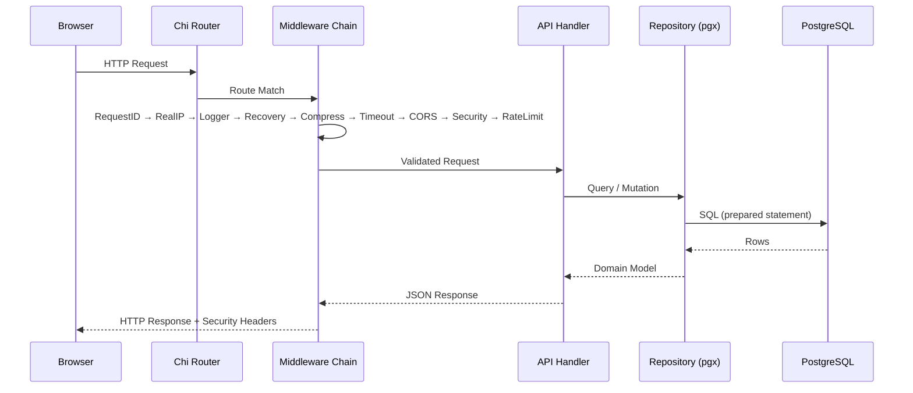

### Middleware Stack

The middleware chain is applied in order, wrapping each request:

1. **RequestID** — Assigns a unique ID to each request for tracing
2. **RealIP** — Extracts the real client IP from proxy headers
3. **Logger** — Structured JSON logging with zerolog (method, path, status, duration)
4. **Recovery** — Catches panics, logs stack trace, returns 500
5. **Compress** — Gzip compression at level 5
6. **Timeout** — 30-second request deadline
7. **CORS** — Cross-origin resource sharing (configurable origins)
8. **Security Headers** — X-Content-Type-Options, X-Frame-Options, HSTS, CSP
9. **Rate Limiting** — 100 requests per minute per IP (httprate)

## Data Flow

### Vehicle Polling Loop

The worker continuously polls the Tesla Fleet API for vehicle data:

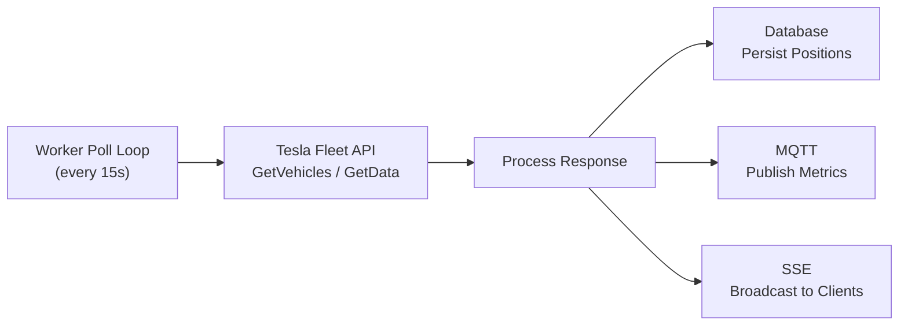

**Polling behavior:**
- **Active vehicles:** Polled every `WORKER_POLL_INTERVAL` (default 15s)
- **Sleeping vehicles:** Polled at `interval × WORKER_SLEEP_POLL_MULT` (default 60s)
- **Failed polls:** Exponential backoff with circuit breaker protection
- **Self-healing:** Automatically recovers when the Tesla API becomes available

### Real-Time Updates (SSE)

Server-Sent Events provide real-time updates to connected browsers:

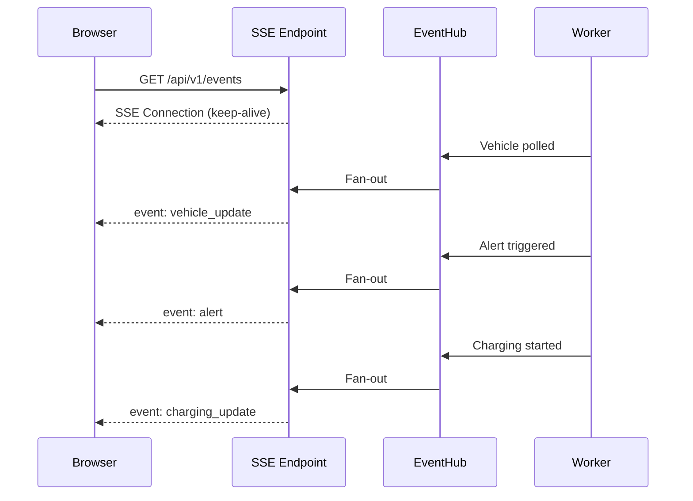

The `EventHub` pattern broadcasts events to all connected clients using goroutines. Each client gets its own channel, and the hub fans out events to all subscribers.

#### SSE Singleton Architecture (Frontend)

The frontend uses a **singleton EventSource** (`web/src/lib/sseManager.ts`) — one connection per browser tab shared across all hooks. Previously each page opened its own SSE connection (up to 16 simultaneous), causing token leaks and connection churn.

```
Browser Tab
  └─ sseManager (singleton EventSource → /api/v1/events)
       ├─ useVehicleLive hook (Dashboard, VehicleDetail, EnergyFlow, ...)
       ├─ useRealtimeEvents hook (Layout.tsx → global alert toast)
       └─ useAdaptiveInterval hook (3s when SSE down, 30s when connected)
```

#### Adaptive Polling

The `useAdaptiveInterval` hook adjusts polling frequency based on SSE connection state:
- **SSE connected:** 30s polling interval (SSE provides real-time data, polling is backup)
- **SSE disconnected:** 3s polling interval (aggressive polling as SSE is unavailable)

### CEP Rule Engine

The Complex Event Processing engine evaluates rules against live telemetry signals on every signal batch:

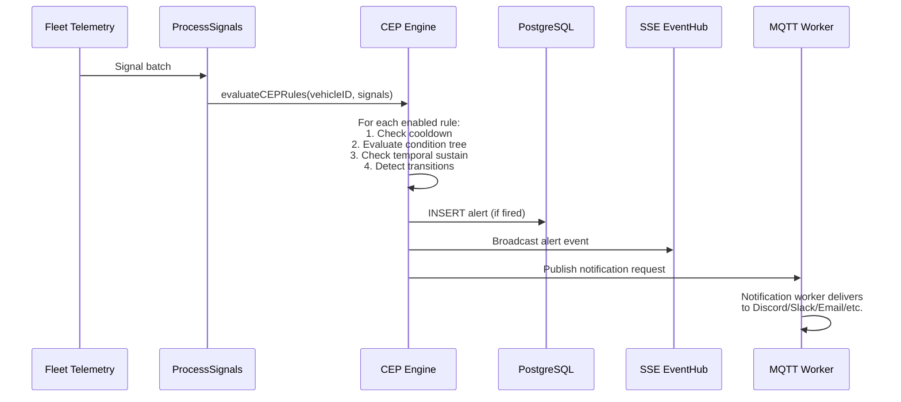

**Key features:**
- **Recursive condition tree** — AND/OR/NOT groups with unlimited nesting
- **11 operators** — comparison, equality, string, boolean, transition detection
- **Temporal sustain** — `for_seconds` requires condition to hold for duration before firing
- **Transition detection** — `changed_to`/`changed_from` compares current vs previous signal values per (ruleID, vehicleID)
- **Per-rule cooldown** — configurable (default 15min), prevents alert spam
- **Template rendering** — `{{BatteryLevel}}` replaced with real signal values
- **Quiet hours** — server-side suppression of non-critical alerts during configured hours

### Vehicle State Machine

The state machine detects vehicle state (driving, charging, parked, asleep, offline) using a priority-based approach:

```
Signal arrives →
  1. Gear-based detection (instant — highest priority)
     └─ Gear=D/R → driving, Gear=P → parked
  2. Speed-based fallback (30s debounce, 2min drive hold)
     └─ Speed > 0 for 30s → driving (when gear not available)
  3. Charging detection
     └─ ChargeState=Charging → charging
  4. Stale gear check (10min freshness)
     └─ Ignore cached gear older than 10min for state detection
  5. Traffic light guard
     └─ Speed=0 but Gear=D/R → stay in driving state
  6. Charging orphan guard
     └─ Starting a drive force-completes any active charge session
```

### MQTT Telemetry

MQTT provides a lightweight pub/sub interface for integrating with home automation systems:

```
Topic Structure:
  teslasync/vehicles/{VIN}/battery_level    → 85
  teslasync/vehicles/{VIN}/rated_range      → 320
  teslasync/vehicles/{VIN}/latitude         → 37.7749
  teslasync/vehicles/{VIN}/longitude        → -122.4194
  teslasync/vehicles/{VIN}/speed            → 0
  teslasync/vehicles/{VIN}/power            → -1.2
  teslasync/vehicles/{VIN}/inside_temp      → 21.5
  teslasync/vehicles/{VIN}/outside_temp     → 18.2
  teslasync/vehicles/{VIN}/is_charging      → false
  teslasync/vehicles/{VIN}/is_locked        → true
  teslasync/vehicles/{VIN}/sentry_mode      → true
  teslasync/vehicles/{VIN}/vehicle_data     → { full JSON }
```

## Database Design

### Native Partitioning

The `positions` table uses PostgreSQL 17 native range partitioning, which automatically organizes data by time for efficient range queries:

```sql
-- Created in migration 001
CREATE TABLE positions (...) PARTITION BY RANGE (created_at);
```

This means queries like "get positions for vehicle X between date A and B" are extremely fast, even with millions of rows.

### Schema Overview

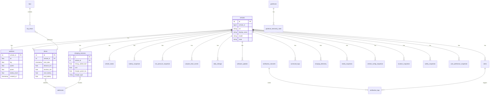

## Database Tables

The schema spans 23 migrations and 47+ tables (778 columns). The data access layer uses a `DBTX` interface for transaction support, allowing repositories to operate within explicit transactions or directly on the pool. Column names, types, and constraints are taken directly from the migration SQL files.

### Core Tables

#### `vehicles`

| Column | Type | Description |
|--------|------|-------------|
| `id` | `BIGSERIAL PK` | Internal auto-increment ID |
| `vehicle_id` | `BIGINT UNIQUE` | Tesla API vehicle ID |
| `vin` | `VARCHAR(17) UNIQUE` | Vehicle Identification Number |
| `display_name` | `VARCHAR(255)` | User-set vehicle name |
| `model` | `VARCHAR(50)` | Model S / 3 / X / Y / Cybertruck |
| `trim_badging` | `VARCHAR(50)` | Trim level (e.g. Long Range, Performance) |
| `exterior_color` | `VARCHAR(50)` | Exterior paint color |
| `wheel_type` | `VARCHAR(50)` | Wheel variant (Aero, Sport, etc.) |
| `state` | `VARCHAR(20)` | online / asleep / driving / charging / offline |
| `healthy` | `BOOLEAN` | Whether the vehicle is reachable |
| `created_at` | `TIMESTAMPTZ` | First sync timestamp |
| `updated_at` | `TIMESTAMPTZ` | Last update timestamp |

#### `positions` *(Partitioned Table)*

Partitioned by `created_at` for fast time-range queries over millions of rows.

| Column | Type | Description |
|--------|------|-------------|
| `id` | `BIGSERIAL` | Row ID (composite PK with `created_at`) |
| `vehicle_id` | `BIGINT FK` | References `vehicles.id` |
| `latitude` | `DOUBLE PRECISION` | GPS latitude |
| `longitude` | `DOUBLE PRECISION` | GPS longitude |
| `speed` | `DOUBLE PRECISION` | Speed in km/h |
| `power` | `DOUBLE PRECISION` | Power draw in kW (negative = regen) |
| `heading` | `INTEGER` | Compass heading 0–360° |
| `elevation` | `DOUBLE PRECISION` | Elevation in meters |
| `odometer` | `DOUBLE PRECISION` | Odometer reading in km |
| `ideal_range` | `DOUBLE PRECISION` | Ideal range estimate in km |
| `rated_range` | `DOUBLE PRECISION` | Rated range estimate in km |
| `battery_level` | `INTEGER` | Battery % (0–100) |
| `inside_temp` | `DOUBLE PRECISION` | Cabin temperature °C |
| `outside_temp` | `DOUBLE PRECISION` | Ambient temperature °C |
| `fan_status` | `INTEGER` | HVAC fan speed |
| `is_climate_on` | `BOOLEAN` | Climate control active |
| `created_at` | `TIMESTAMPTZ` | Timestamp (partition key) |

#### `drives`

| Column | Type | Description |
|--------|------|-------------|
| `id` | `BIGSERIAL PK` | Drive ID |
| `vehicle_id` | `BIGINT FK` | References `vehicles.id` |
| `start_date` | `TIMESTAMPTZ` | Drive start timestamp |
| `end_date` | `TIMESTAMPTZ` | Drive end timestamp (NULL if in progress) |
| `start_position_id` | `BIGINT` | Starting position row ID |
| `end_position_id` | `BIGINT` | Ending position row ID |
| `start_address_id` | `BIGINT` | Starting address FK |
| `end_address_id` | `BIGINT` | Ending address FK |
| `distance` | `DOUBLE PRECISION` | Distance driven in km |
| `duration_min` | `DOUBLE PRECISION` | Duration in minutes |
| `start_range_km` | `DOUBLE PRECISION` | Rated range at start |
| `end_range_km` | `DOUBLE PRECISION` | Rated range at end |
| `speed_max` | `DOUBLE PRECISION` | Maximum speed in km/h |
| `power_max` | `DOUBLE PRECISION` | Peak power draw in kW |
| `power_min` | `DOUBLE PRECISION` | Max regen power in kW (negative) |
| `start_battery_level` | `INTEGER` | Battery % at start |
| `end_battery_level` | `INTEGER` | Battery % at end |
| `inside_temp_avg` | `DOUBLE PRECISION` | Average cabin temp °C |
| `outside_temp_avg` | `DOUBLE PRECISION` | Average ambient temp °C |

#### `charging_sessions`

| Column | Type | Description |
|--------|------|-------------|
| `id` | `BIGSERIAL PK` | Session ID |
| `vehicle_id` | `BIGINT FK` | References `vehicles.id` |
| `start_date` | `TIMESTAMPTZ` | Charging start |
| `end_date` | `TIMESTAMPTZ` | Charging end (NULL if active) |
| `address_id` | `BIGINT` | Location FK |
| `charge_energy_added` | `DOUBLE PRECISION` | Energy added in kWh |
| `charge_energy_used` | `DOUBLE PRECISION` | Total energy drawn (incl. losses) |
| `start_battery_level` | `INTEGER` | Battery % at start |
| `end_battery_level` | `INTEGER` | Battery % at end |
| `start_range_km` | `DOUBLE PRECISION` | Range at start |
| `end_range_km` | `DOUBLE PRECISION` | Range at end |
| `charger_phases` | `INTEGER` | AC phases (1 or 3) |
| `charger_voltage` | `INTEGER` | Charger voltage (V) |
| `charger_actual_current` | `INTEGER` | Actual current (A) |
| `charger_power` | `DOUBLE PRECISION` | Charger power in kW |
| `fast_charger_type` | `VARCHAR(100)` | DC fast charger type |
| `fast_charger_brand` | `VARCHAR(100)` | Supercharger / CCS / CHAdeMO brand |
| `conn_charge_cable` | `VARCHAR(100)` | Cable type (SAE, IEC, etc.) |
| `cost` | `DOUBLE PRECISION` | Estimated cost |
| `duration_min` | `DOUBLE PRECISION` | Session duration in minutes |

#### `addresses`

| Column | Type | Description |
|--------|------|-------------|
| `id` | `BIGSERIAL PK` | Address ID |
| `display_name` | `TEXT` | Human-readable label |
| `latitude` | `DOUBLE PRECISION` | Latitude |
| `longitude` | `DOUBLE PRECISION` | Longitude |
| `name` | `VARCHAR(255)` | Place name |
| `house_number` | `VARCHAR(50)` | Street number |
| `road` | `VARCHAR(255)` | Street name |
| `city` | `VARCHAR(255)` | City |
| `county` | `VARCHAR(255)` | County / district |
| `state` | `VARCHAR(255)` | State / province |
| `country` | `VARCHAR(255)` | Country |
| `postcode` | `VARCHAR(50)` | Postal code |
| `created_at` | `TIMESTAMPTZ` | Created timestamp |

#### `geofences`

| Column | Type | Description |
|--------|------|-------------|
| `id` | `BIGSERIAL PK` | Geofence ID |
| `name` | `VARCHAR(255)` | Geofence label |
| `latitude` | `DOUBLE PRECISION` | Center latitude |
| `longitude` | `DOUBLE PRECISION` | Center longitude |
| `radius` | `DOUBLE PRECISION` | Radius in meters (default 50) |
| `cost_per_kwh` | `DOUBLE PRECISION` | Current electricity rate (added in migration 4) |
| `created_at` | `TIMESTAMPTZ` | Created timestamp |
| `updated_at` | `TIMESTAMPTZ` | Last update timestamp |

#### `geofence_electricity_rates`

Temporal versioning — when `cost_per_kwh` changes, old rates are preserved so historical charging costs remain accurate.

| Column | Type | Description |
|--------|------|-------------|
| `id` | `BIGSERIAL PK` | Rate ID |
| `geofence_id` | `BIGINT FK` | References `geofences.id` |
| `cost_per_kwh` | `DOUBLE PRECISION` | Rate in local currency per kWh |
| `effective_from` | `TIMESTAMPTZ` | Rate start date |
| `effective_to` | `TIMESTAMPTZ` | Rate end date (NULL = current) |
| `created_at` | `TIMESTAMPTZ` | Created timestamp |

### State & Telemetry Tables

#### `vehicle_states`

| Column | Type | Description |
|--------|------|-------------|
| `id` | `BIGSERIAL PK` | State record ID |
| `vehicle_id` | `BIGINT FK` | References `vehicles.id` |
| `state` | `VARCHAR(20)` | online / asleep / driving / charging / updating / offline |
| `start_date` | `TIMESTAMPTZ` | State start time |
| `end_date` | `TIMESTAMPTZ` | State end time (NULL if current) |
| `duration_min` | `DOUBLE PRECISION` | Duration in minutes |
| `created_at` | `TIMESTAMPTZ` | Created timestamp |

#### `battery_snapshots`

| Column | Type | Description |
|--------|------|-------------|
| `id` | `BIGSERIAL PK` | Snapshot ID |
| `vehicle_id` | `BIGINT FK` | References `vehicles.id` |
| `health_score` | `DOUBLE PRECISION` | Battery health 0–100 |
| `capacity_kwh` | `DOUBLE PRECISION` | Current usable capacity |
| `degradation_pct` | `DOUBLE PRECISION` | Degradation percentage |
| `est_range_km` | `DOUBLE PRECISION` | Estimated range |
| `cycle_count` | `INTEGER` | Charge cycle count |
| `avg_cell_temp_c` | `DOUBLE PRECISION` | Average cell temperature °C |
| `created_at` | `TIMESTAMPTZ` | Snapshot timestamp |

#### `tire_pressure_snapshots`

| Column | Type | Description |
|--------|------|-------------|
| `id` | `BIGSERIAL PK` | Snapshot ID |
| `vehicle_id` | `BIGINT FK` | References `vehicles.id` |
| `front_left` | `DOUBLE PRECISION` | Front-left pressure (bar) |
| `front_right` | `DOUBLE PRECISION` | Front-right pressure (bar) |
| `rear_left` | `DOUBLE PRECISION` | Rear-left pressure (bar) |
| `rear_right` | `DOUBLE PRECISION` | Rear-right pressure (bar) |
| `created_at` | `TIMESTAMPTZ` | Timestamp |

#### `vampire_drain_events`

| Column | Type | Description |
|--------|------|-------------|
| `id` | `BIGSERIAL PK` | Event ID |
| `vehicle_id` | `BIGINT FK` | References `vehicles.id` |
| `start_date` | `TIMESTAMPTZ` | Drain period start |
| `end_date` | `TIMESTAMPTZ` | Drain period end |
| `start_battery` | `INTEGER` | Battery % at start |
| `end_battery` | `INTEGER` | Battery % at end |
| `battery_lost` | `INTEGER` | Percentage points lost |
| `range_lost_km` | `DOUBLE PRECISION` | Range lost in km |
| `duration_hours` | `DOUBLE PRECISION` | Parked duration in hours |
| `drain_rate_pct_per_hour` | `DOUBLE PRECISION` | Drain rate %/hr |
| `outside_temp_avg` | `DOUBLE PRECISION` | Average ambient temp °C |
| `sentry_mode` | `BOOLEAN` | Whether Sentry Mode was active |
| `created_at` | `TIMESTAMPTZ` | Created timestamp |

#### Motor Snapshots (`motor_snapshots`)

Stores motor/powertrain telemetry data from fleet telemetry stream.

| Column | Type | Description |
|--------|------|-------------|
| `id` | `BIGSERIAL PK` | Primary key |
| `vehicle_id` | `BIGINT FK` | Foreign key to vehicles |
| `di_state` | `VARCHAR(20)` | Drive inverter state (Enabled/Standby/Disabled) |
| `di_torque` | `DOUBLE PRECISION` | Motor torque output (Nm) |
| `di_axle_speed` | `DOUBLE PRECISION` | Rear axle speed (RPM) |
| `di_stator_temp` | `DOUBLE PRECISION` | Stator temperature (°C) |
| `pedal_position` | `DOUBLE PRECISION` | Accelerator pedal position (%) |
| `brake_pedal` | `BOOLEAN` | Brake pedal engaged |
| `lateral_accel` | `DOUBLE PRECISION` | Lateral acceleration (g) |
| `longitudinal_accel` | `DOUBLE PRECISION` | Longitudinal acceleration (g) |
| `vehicle_speed` | `DOUBLE PRECISION` | Vehicle speed (km/h) |
| `gear` | `VARCHAR(5)` | Transmission gear (D/R/N/P) |
| `created_at` | `TIMESTAMPTZ` | Snapshot timestamp |

#### Climate Snapshots (`climate_snapshots`)

Stores HVAC and climate telemetry data.

| Column | Type | Description |
|--------|------|-------------|
| `id` | `BIGSERIAL PK` | Primary key |
| `vehicle_id` | `BIGINT FK` | Foreign key to vehicles |
| `inside_temp` | `DOUBLE PRECISION` | Cabin temperature (°C) |
| `outside_temp` | `DOUBLE PRECISION` | Ambient temperature (°C) |
| `hvac_power` | `DOUBLE PRECISION` | HVAC power consumption (kW) |
| `hvac_fan_speed` | `INTEGER` | Fan speed level (0-6) |
| `hvac_left_temp_request` | `DOUBLE PRECISION` | Left zone target (°C) |
| `hvac_right_temp_request` | `DOUBLE PRECISION` | Right zone target (°C) |
| `cabin_overheat_mode` | `VARCHAR(10)` | Cabin overheat protection |
| `defrost_mode` | `BOOLEAN` | Defrost active |
| `battery_heater_on` | `BOOLEAN` | Battery heater active |
| `created_at` | `TIMESTAMPTZ` | Snapshot timestamp |

#### Security Events (`security_events`)

Stores vehicle security and access state changes.

| Column | Type | Description |
|--------|------|-------------|
| `id` | `BIGSERIAL PK` | Primary key |
| `vehicle_id` | `BIGINT FK` | Foreign key to vehicles |
| `locked` | `BOOLEAN` | Vehicle lock status |
| `sentry_mode` | `BOOLEAN` | Sentry mode active |
| `door_state` | `VARCHAR(20)` | Door closure state |
| `fd_window` | `VARCHAR(20)` | Front driver window state |
| `fp_window` | `VARCHAR(20)` | Front passenger window state |
| `rd_window` | `VARCHAR(20)` | Rear driver window state |
| `rp_window` | `VARCHAR(20)` | Rear passenger window state |
| `homelink_nearby` | `BOOLEAN` | HomeLink detected |
| `guest_mode` | `BOOLEAN` | Guest mode active |
| `created_at` | `TIMESTAMPTZ` | Event timestamp |

#### Charging Telemetry (`charging_telemetry`)

55-column table storing real-time charging data from fleet telemetry (migration 000017).

| Column | Type | Description |
|--------|------|-------------|
| `id` | `BIGSERIAL PK` | Primary key |
| `vehicle_id` | `BIGINT FK` | Foreign key to vehicles |
| `pack_voltage` | `DOUBLE PRECISION` | Battery pack voltage (V) |
| `pack_current` | `DOUBLE PRECISION` | Battery pack current (A) |
| `charging_power` | `DOUBLE PRECISION` | Total charging power (kW) |
| `ac_charging_power` | `DOUBLE PRECISION` | AC charging power (kW) |
| `dc_charging_power` | `DOUBLE PRECISION` | DC charging power (kW) |
| `supercharger_state` | `VARCHAR(20)` | Supercharger connection state |
| `bms_state` | `VARCHAR(20)` | BMS operating state |
| `bms_fullchargecomplete` | `BOOLEAN` | BMS full charge flag |
| `powershare_status` | `VARCHAR(20)` | Powershare (V2H/V2G) status |
| `cell_voltages` | `JSONB` | Individual cell voltages |
| `module_temps` | `JSONB` | Module temperature readings |
| `created_at` | `TIMESTAMPTZ` | Snapshot timestamp |

*Plus ~40 additional columns for detailed BMS, cell balance, and charging circuit data.*

#### Media Snapshots (`media_snapshots`)

Stores media/entertainment state from fleet telemetry (migration 000017).

| Column | Type | Description |
|--------|------|-------------|
| `id` | `BIGSERIAL PK` | Primary key |
| `vehicle_id` | `BIGINT FK` | Foreign key to vehicles |
| `playback_status` | `VARCHAR(20)` | Playing / Paused / Stopped |
| `volume` | `DOUBLE PRECISION` | Volume level (0–11) |
| `source` | `VARCHAR(50)` | Media source (Spotify, Radio, etc.) |
| `artist` | `TEXT` | Current artist |
| `title` | `TEXT` | Current track title |
| `album` | `TEXT` | Current album |
| `created_at` | `TIMESTAMPTZ` | Snapshot timestamp |

#### Vehicle Config Snapshots (`vehicle_config_snapshots`)

Stores vehicle configuration state from fleet telemetry (migration 000017).

| Column | Type | Description |
|--------|------|-------------|
| `id` | `BIGSERIAL PK` | Primary key |
| `vehicle_id` | `BIGINT FK` | Foreign key to vehicles |
| `trim_badging` | `VARCHAR(50)` | Trim level |
| `exterior_color` | `VARCHAR(50)` | Paint color |
| `roof_color` | `VARCHAR(50)` | Roof color |
| `spoiler_type` | `VARCHAR(50)` | Spoiler type |
| `software_version` | `VARCHAR(100)` | Current firmware version |
| `created_at` | `TIMESTAMPTZ` | Snapshot timestamp |

#### Location Snapshots (`location_snapshots`)

Stores navigation/destination state from fleet telemetry (migration 000017).

| Column | Type | Description |
|--------|------|-------------|
| `id` | `BIGSERIAL PK` | Primary key |
| `vehicle_id` | `BIGINT FK` | Foreign key to vehicles |
| `destination_location` | `TEXT` | Active navigation destination |
| `route_last_updated` | `TIMESTAMPTZ` | Last route update time |
| `home_nearby` | `BOOLEAN` | Near home location |
| `work_nearby` | `BOOLEAN` | Near work location |
| `favorite_nearby` | `BOOLEAN` | Near a saved favorite |
| `created_at` | `TIMESTAMPTZ` | Snapshot timestamp |

#### Safety Snapshots (`safety_snapshots`)

Stores ADAS and safety configuration from fleet telemetry (migration 000017).

| Column | Type | Description |
|--------|------|-------------|
| `id` | `BIGSERIAL PK` | Primary key |
| `vehicle_id` | `BIGINT FK` | Foreign key to vehicles |
| `forward_collision_warning` | `VARCHAR(20)` | FCW sensitivity setting |
| `lane_departure_avoidance` | `VARCHAR(20)` | LDA mode |
| `emergency_lane_departure` | `BOOLEAN` | Emergency lane departure active |
| `auto_steer` | `VARCHAR(20)` | Autosteer mode |
| `fsd_miles_since_reset` | `DOUBLE PRECISION` | FSD miles since last reset |
| `created_at` | `TIMESTAMPTZ` | Snapshot timestamp |

#### User Preference Snapshots (`user_preference_snapshots`)

Stores user unit/format preferences from fleet telemetry (migration 000017).

| Column | Type | Description |
|--------|------|-------------|
| `id` | `BIGSERIAL PK` | Primary key |
| `vehicle_id` | `BIGINT FK` | Foreign key to vehicles |
| `distance_unit` | `VARCHAR(5)` | km or mi |
| `temperature_unit` | `VARCHAR(5)` | C or F |
| `24_hour_clock` | `BOOLEAN` | 24-hour time format |
| `charge_current_request` | `INTEGER` | Requested charge current (A) |
| `created_at` | `TIMESTAMPTZ` | Snapshot timestamp |

### Mileage & Trip Tables

#### `daily_mileage`

| Column | Type | Description |
|--------|------|-------------|
| `id` | `BIGSERIAL PK` | Row ID |
| `vehicle_id` | `BIGINT FK` | References `vehicles.id` |
| `date` | `DATE` | Calendar date (unique per vehicle) |
| `distance_km` | `DOUBLE PRECISION` | Total distance driven |
| `odometer_start` | `DOUBLE PRECISION` | Odometer at start of day |
| `odometer_end` | `DOUBLE PRECISION` | Odometer at end of day |
| `drive_count` | `INTEGER` | Number of drives |
| `energy_used_kwh` | `DOUBLE PRECISION` | Energy consumed |

#### `visited_locations`

| Column | Type | Description |
|--------|------|-------------|
| `id` | `BIGSERIAL PK` | Row ID |
| `vehicle_id` | `BIGINT FK` | References `vehicles.id` |
| `address_id` | `BIGINT FK` | References `addresses.id` |
| `visit_count` | `INTEGER` | Total visits |
| `total_duration_min` | `DOUBLE PRECISION` | Total time spent (min) |
| `last_visited` | `TIMESTAMPTZ` | Most recent visit |
| `created_at` | `TIMESTAMPTZ` | Created timestamp |

#### `trips`

| Column | Type | Description |
|--------|------|-------------|
| `id` | `BIGSERIAL PK` | Trip ID |
| `vehicle_id` | `BIGINT FK` | References `vehicles.id` |
| `name` | `VARCHAR(255)` | Trip label |
| `start_date` | `TIMESTAMPTZ` | Trip start |
| `end_date` | `TIMESTAMPTZ` | Trip end |
| `total_distance_km` | `DOUBLE PRECISION` | Total distance |
| `total_energy_kwh` | `DOUBLE PRECISION` | Total energy used |
| `total_cost` | `DOUBLE PRECISION` | Total charging cost |
| `drive_count` | `INTEGER` | Drives in trip |
| `charge_count` | `INTEGER` | Charging stops |
| `created_at` | `TIMESTAMPTZ` | Created timestamp |

#### `trip_drives`

Join table linking trips to their constituent drives.

| Column | Type | Description |
|--------|------|-------------|
| `trip_id` | `BIGINT FK PK` | References `trips.id` |
| `drive_id` | `BIGINT FK PK` | References `drives.id` |

### Software & System Tables

#### `software_updates`

| Column | Type | Description |
|--------|------|-------------|
| `id` | `BIGSERIAL PK` | Update ID |
| `vehicle_id` | `BIGINT FK` | References `vehicles.id` |
| `version` | `VARCHAR(100)` | Software version string |
| `status` | `VARCHAR(50)` | available / downloading / installing / installed |
| `scheduled_at` | `TIMESTAMPTZ` | Scheduled install time |
| `installed_at` | `TIMESTAMPTZ` | Actual install time |
| `created_at` | `TIMESTAMPTZ` | Created timestamp |

#### `alerts`

| Column | Type | Description |
|--------|------|-------------|
| `id` | `BIGSERIAL PK` | Alert ID |
| `vehicle_id` | `BIGINT FK` | References `vehicles.id` (SET NULL on delete) |
| `type` | `VARCHAR(50)` | Alert type (battery_low, speed, geofence, etc.) |
| `severity` | `VARCHAR(20)` | info / warning / critical |
| `title` | `VARCHAR(500)` | Alert title |
| `message` | `TEXT` | Detailed message |
| `is_read` | `BOOLEAN` | Read status |
| `created_at` | `TIMESTAMPTZ` | Created timestamp |

#### `alert_rules`

| Column | Type | Description |
|--------|------|-------------|
| `id` | `BIGSERIAL PK` | Rule ID |
| `name` | `VARCHAR(255)` | Rule name |
| `type` | `VARCHAR(50)` | Rule type (battery_low, battery_full, sentry, speed, geofence, software) |
| `enabled` | `BOOLEAN` | Whether the rule is active |
| `threshold` | `DOUBLE PRECISION` | Trigger threshold value |
| `vehicle_id` | `BIGINT FK` | Optional vehicle scope (NULL = all vehicles) |
| `created_at` | `TIMESTAMPTZ` | Created timestamp |
| `updated_at` | `TIMESTAMPTZ` | Last update |

#### `command_logs`

| Column | Type | Description |
|--------|------|-------------|
| `id` | `BIGSERIAL PK` | Log ID |
| `vehicle_id` | `BIGINT FK` | References `vehicles.id` |
| `command` | `VARCHAR(100)` | Command name (flash_lights, honk_horn, etc.) |
| `params` | `TEXT` | JSON-encoded parameters |
| `status` | `VARCHAR(20)` | pending / success / failed |
| `error` | `TEXT` | Error message if failed |
| `created_at` | `TIMESTAMPTZ` | Created timestamp |

### Notification Tables

#### `notification_channels`

| Column | Type | Description |
|--------|------|-------------|
| `id` | `BIGSERIAL PK` | Channel ID |
| `name` | `TEXT` | Channel label |
| `type` | `TEXT` | discord / email / slack / telegram / webhook / ntfy / pushover |
| `config` | `JSONB` | Type-specific configuration (webhook URLs, tokens, etc.) |
| `enabled` | `BOOLEAN` | Whether channel is active |
| `created_at` | `TIMESTAMPTZ` | Created timestamp |
| `updated_at` | `TIMESTAMPTZ` | Last update |

#### `notification_logs`

| Column | Type | Description |
|--------|------|-------------|
| `id` | `BIGSERIAL PK` | Log ID |
| `channel_id` | `BIGINT FK` | References `notification_channels.id` |
| `alert_id` | `BIGINT FK` | References `alerts.id` (SET NULL on delete) |
| `title` | `TEXT` | Notification title |
| `message` | `TEXT` | Notification body |
| `status` | `TEXT` | pending / sent / failed |
| `error` | `TEXT` | Error details if failed |
| `created_at` | `TIMESTAMPTZ` | Created timestamp |
| `sent_at` | `TIMESTAMPTZ` | Delivery timestamp |

#### `chatbot_messages`

| Column | Type | Description |
|--------|------|-------------|
| `id` | `BIGSERIAL PK` | Message ID |
| `session_id` | `TEXT` | Conversation session identifier |
| `role` | `TEXT` | user / assistant |
| `content` | `TEXT` | Message content |
| `created_at` | `TIMESTAMPTZ` | Created timestamp |

### Authentication & Config Tables

#### `tokens`

Single-row table (enforced by `CHECK (id = 1)`) storing the Tesla OAuth2 credentials.

| Column | Type | Description |
|--------|------|-------------|
| `id` | `INTEGER PK` | Always 1 |
| `access_token` | `TEXT` | Tesla API access token |
| `refresh_token` | `TEXT` | Tesla API refresh token |
| `expires_at` | `TIMESTAMPTZ` | Token expiration |
| `created_at` | `TIMESTAMPTZ` | Created timestamp |
| `updated_at` | `TIMESTAMPTZ` | Last refresh timestamp |

#### `settings`

Single-row table for global application preferences.

| Column | Type | Description |
|--------|------|-------------|
| `id` | `INTEGER PK` | Always 1 |
| `unit_of_length` | `VARCHAR(5)` | `km` or `mi` |
| `unit_of_temp` | `VARCHAR(5)` | `C` or `F` |
| `preferred_range` | `VARCHAR(10)` | `rated` or `ideal` |
| `language` | `VARCHAR(10)` | Language code (e.g. `en`) |
| `base_cost_per_kwh` | `DOUBLE PRECISION` | Default electricity cost |
| `api_suspended` | `BOOLEAN` | Suspend all Tesla API calls |
| `theme` | `VARCHAR(20)` | UI theme (e.g. `neon-cyan`) |
| `mode` | `VARCHAR(20)` | UI mode (`dark`, `light`, `oled`, `midnight`) |
| `custom_primary` | `VARCHAR(10)` | Custom theme primary color (hex) |
| `custom_accent` | `VARCHAR(10)` | Custom theme accent color (hex) |
| `gas_price_per_unit` | `DOUBLE PRECISION` | Gas price for ICE comparison |
| `gas_unit` | `VARCHAR(10)` | `gallon` or `liter` |
| `gas_efficiency_mpg` | `DOUBLE PRECISION` | Comparison ICE vehicle MPG |
| `polling_config` | `JSONB` | Per-endpoint polling toggles (20 booleans for polling, on-demand, and commands) |

### Data Retention

A background maintenance worker periodically cleans up old data:

- **General data** (drives, charging, etc.): Retained for `DATA_RETENTION_DAYS` (default 365)
- **GPS positions:** Retained for `POSITION_RETENTION_DAYS` (default 90)

## Resilience Patterns

### Circuit Breaker (Tesla API)

The Tesla API client uses the Sony gobreaker circuit breaker to prevent cascading failures:

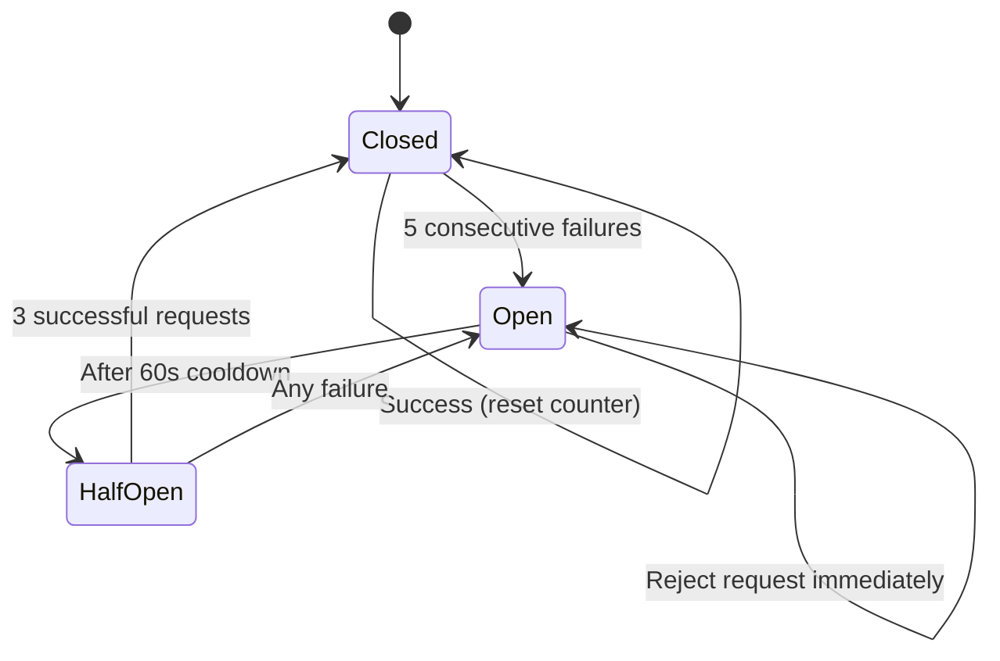

### Health Monitoring

Four components are continuously monitored:

| Component | Check Method | Interval |
|-----------|-------------|----------|
| `database` | `SELECT 1` with 5s timeout | 60s |
| `mqtt` | Connection status | 60s |
| `tesla_api` | Circuit breaker state | 60s |
| `worker` | Goroutine alive check | 60s |

Degraded components are logged as warnings and reported via `/api/v1/system/status`.

### Graceful Shutdown

On receiving SIGINT or SIGTERM, TeslaSync performs an ordered shutdown:

1. Cancel the root context (signals all goroutines to stop)
2. HTTP server: 30-second drain period for in-flight requests
3. Close database connection pool
4. Disconnect MQTT client
5. Stop worker goroutines

### Event-Driven Architecture

TeslaSync publishes domain events to MQTT whenever significant state changes occur. This decouples components and enables asynchronous processing.

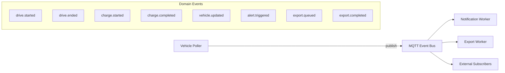

**Event Topics:** `teslasync/events/{event_type}`

| Event | Trigger | Data |
|---|---|---|
| `drive.started` | Speed > 0 detected | drive_id, battery_level |
| `drive.ended` | Speed returns to 0 | drive_id, battery_level |
| `charge.started` | ChargingState == "Charging" | session_id, battery_level |
| `charge.completed` | Charging stops | session_id, battery_level, energy_added |
| `export.queued` | Export job submitted | job_id, type, format |
| `export.completed` | Export job finished | job_id, file_name, record_count |
| `export.failed` | Export job failed | job_id, error |

### Notification Worker

Notifications are delivered asynchronously via an MQTT-backed worker:

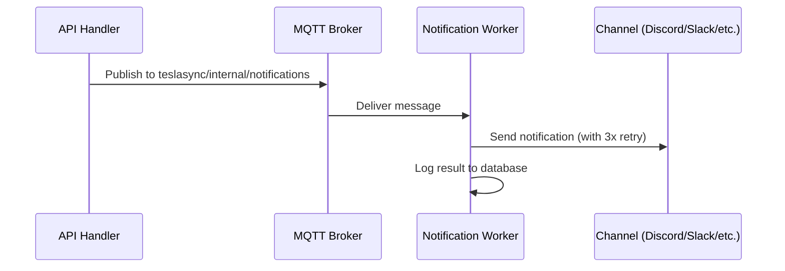

Supported channels: Discord, Slack, Telegram, Webhook, Ntfy, Pushover, Email.

### Export Worker

Data exports and database backups are processed asynchronously via a dedicated MQTT-backed worker:

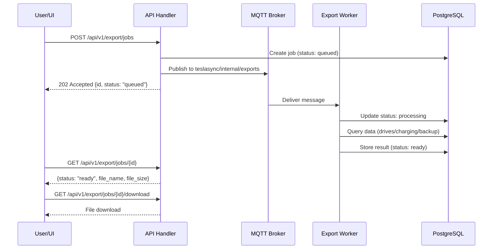

Supported export types: drives, charging, database backup. The worker also performs periodic cleanup of old export jobs (>7 days).

### Redis Caching

TeslaSync uses a two-tier caching strategy:

| Tier | Backend | TTL | Purpose |
|---|---|---|---|
| L1 | In-memory (per-process) | Short (seconds) | Hot path dedup |
| L2 | Redis (shared) | Medium (minutes) | Cross-request caching |

When Redis is unavailable, the system falls back to in-memory caching automatically.

## Frontend Architecture

### Component Hierarchy

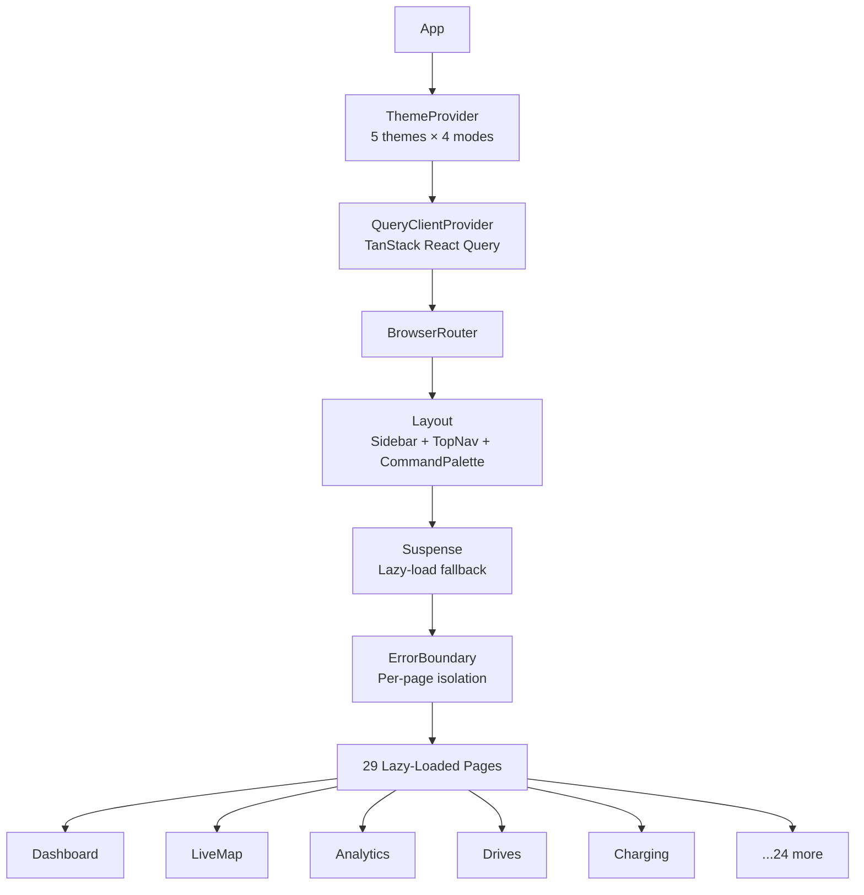

### State Management

- **Server state:** TanStack React Query (automatic caching, refetching, deduplication)
- **Real-time state:** `useRealtimeEvents` hook with SSE auto-reconnect
- **UI state:** React `useState` / `useReducer` (local component state)
- **Theme state:** React Context with localStorage persistence

### Build Pipeline


Vite produces an optimized SPA bundle with:
- Code splitting (per-route lazy loading)
- Tree shaking (unused code elimination)
- Asset hashing (cache busting)
- Gzip-ready output
