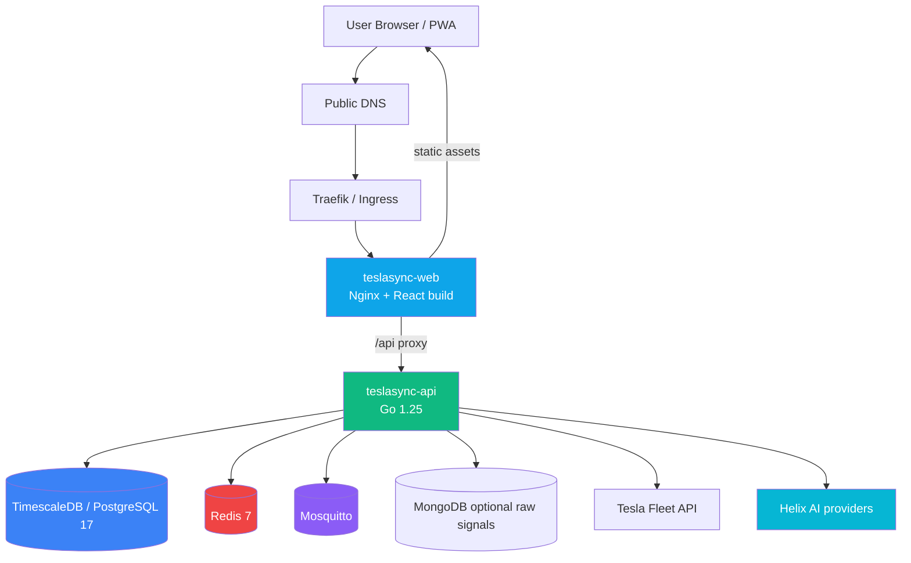
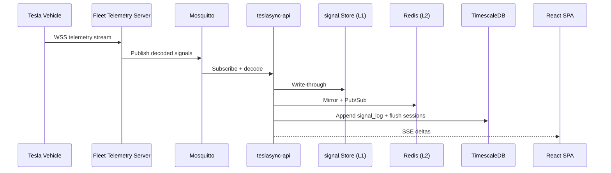
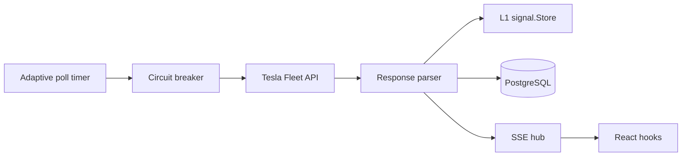
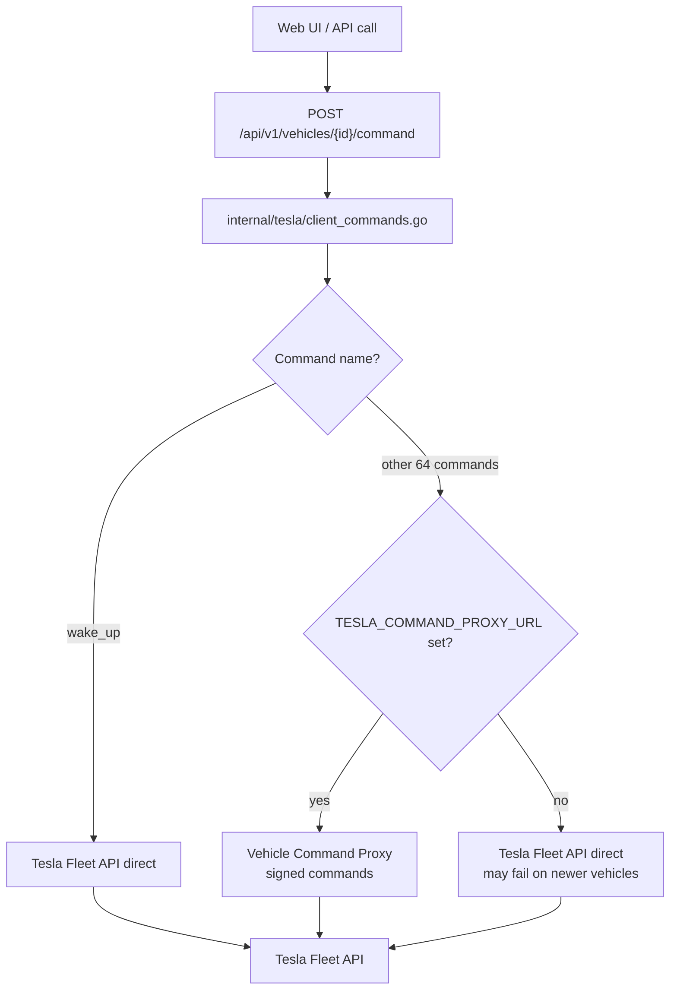
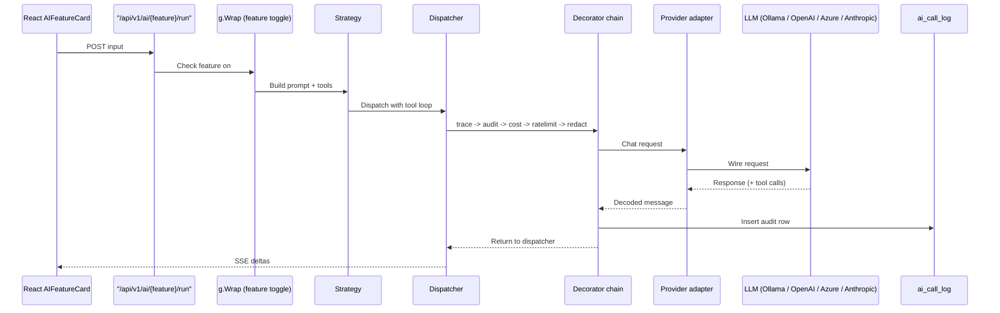
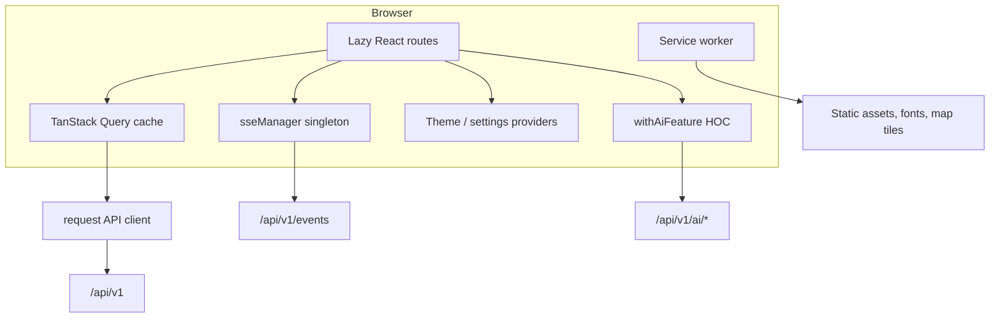
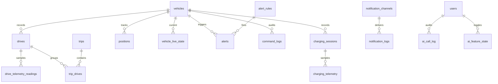

# Diagrams

Visual diagrams for the current TeslaSync architecture, data flows, and deployment topology. Click diagrams to zoom using the VitePress theme overlay.

## Production traffic

## Fleet Telemetry ingestion

## Polling fallback

## Remote-command routing

See [Remote Commands](/guide/remote-commands) for the full 65-endpoint reference.

## Helix AI request

## Frontend data flow

## Database relationship sketch

## Deployment modes

