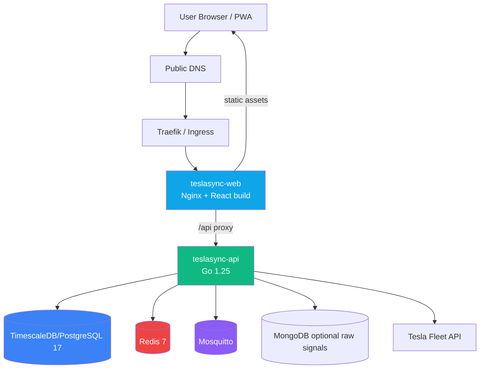
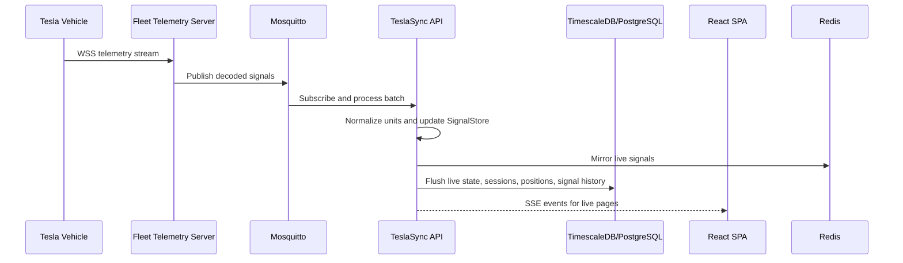
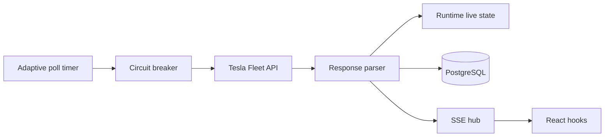
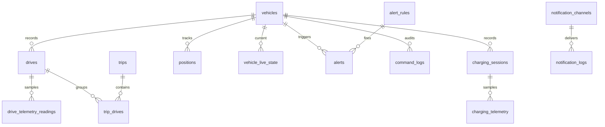
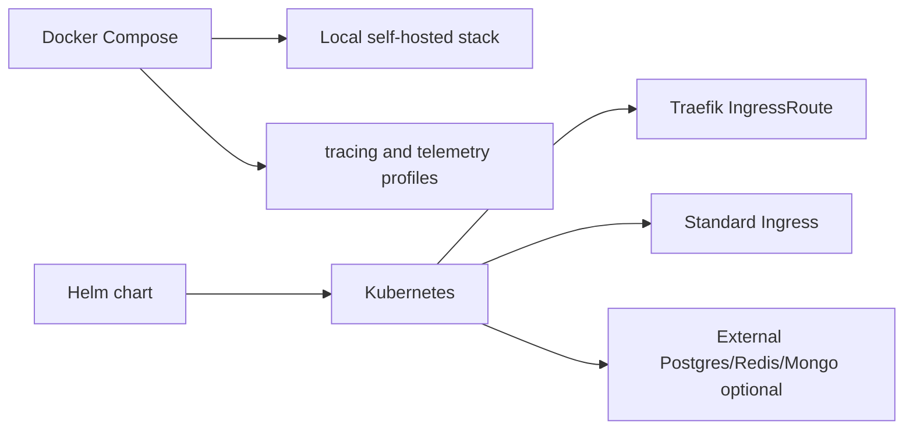

# Diagrams

Visual diagrams for the current TeslaSync architecture, data flows, and deployment topology. Click diagrams to zoom using the custom VitePress theme overlay.

## Production traffic



## Fleet Telemetry ingestion



## Polling fallback



## Frontend data flow

```mermaid
graph TB
    subgraph Browser
        Routes[Lazy React routes]
        Query[TanStack Query cache]
        SSE[sseManager singleton]
        Theme[Theme/settings providers]
        PWA[Service worker]
    end

    Routes --> Query
    Routes --> SSE
    Routes --> Theme
    Query --> Client[request() API client]
    Client --> API[/api/v1]
    SSE --> Events[/api/v1 events]
    PWA --> Assets[Static assets, fonts, map tiles]
```

## Database relationship sketch



## Deployment modes


