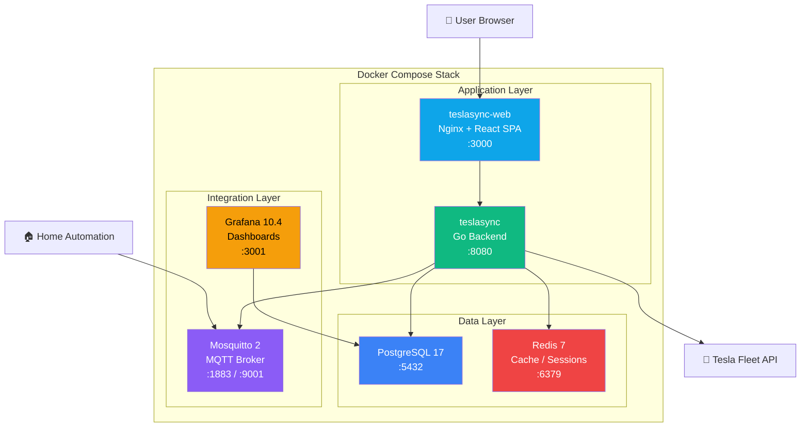
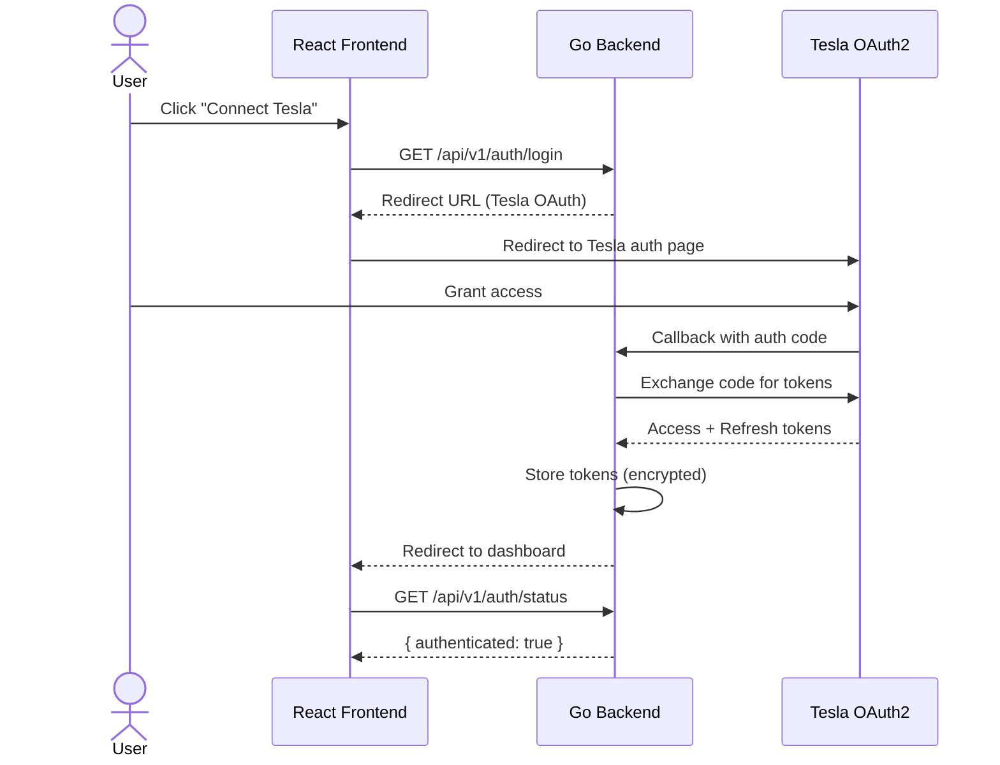
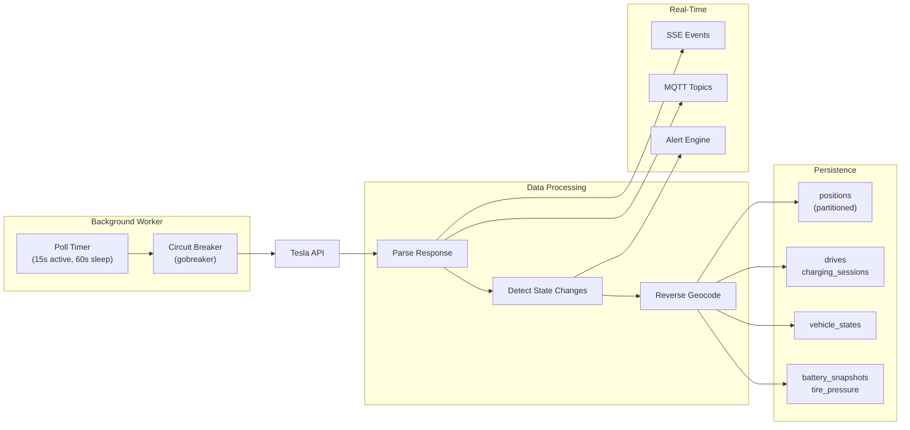
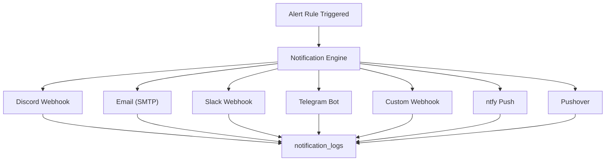
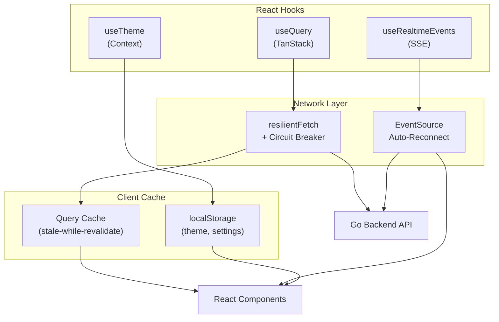
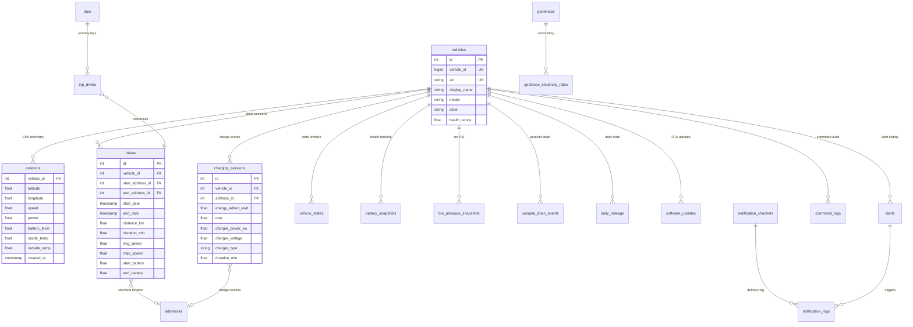
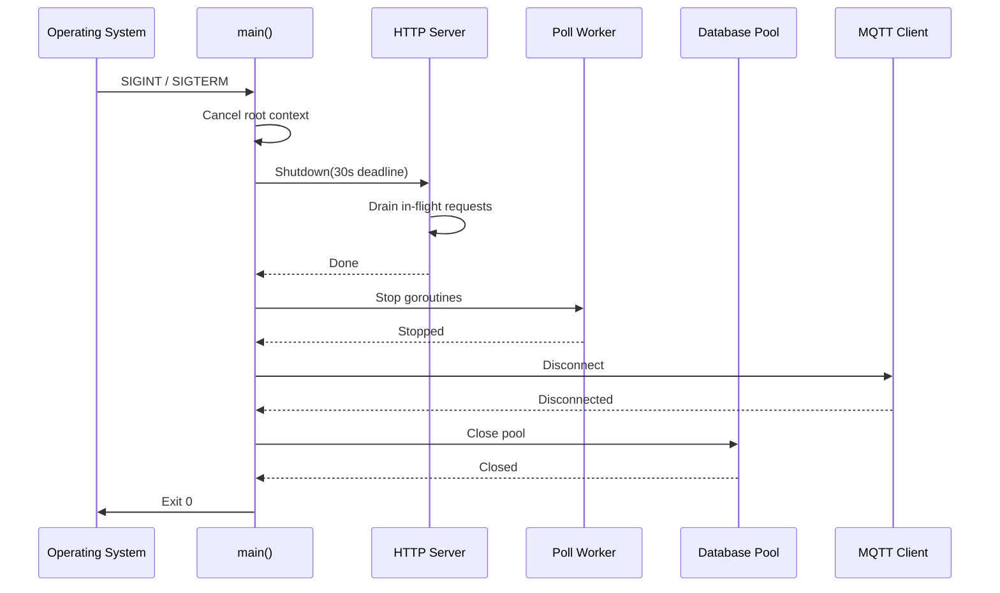

# Diagrams

Visual diagrams documenting the TeslaSync architecture, data flows, and deployment topology.

## Deployment Architecture

## Authentication Flow

## Vehicle Data Collection Pipeline

## Notification Delivery

## Frontend Data Flow

## Database Table Relationships

## Graceful Shutdown Sequence

