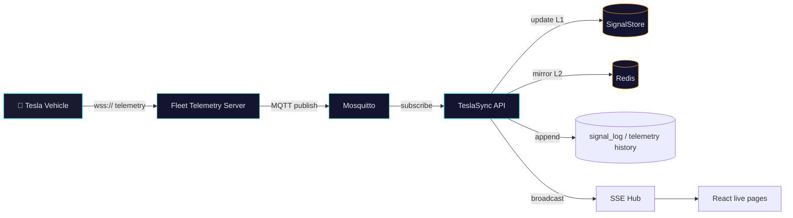
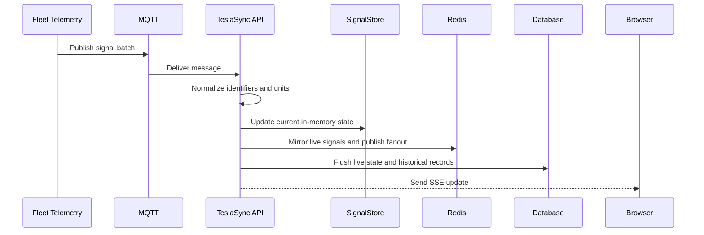

# Fleet Telemetry

Fleet Telemetry is TeslaSync's preferred high-frequency data path. It streams vehicle signals instead of relying only on Fleet API polling, then feeds the same live-state, analytics, alerting, and UI systems.

## Why use it

| Capability | Polling | Fleet Telemetry |
|---|---|---|
| Latency | Poll interval dependent | Near real-time while the vehicle streams |
| API usage | Higher | Lower for state changes |
| Vehicle wake behavior | Can require wake/refresh calls | Streams when the vehicle is online and configured |
| Setup | Simple | Requires public TLS endpoint and Tesla telemetry setup |

::: warning
Do not document exact Tesla billing savings unless you have current billing data for your account. Costs and product terms can change.
:::

## Architecture



## Signal pipeline



## Required production pieces

| Requirement | Notes |
|---|---|
| Tesla Developer account | Fleet Telemetry access must be available for your app/account. |
| Public HTTPS/WSS endpoint | Vehicles require a publicly trusted TLS certificate. |
| Tesla public key URL | Serve `/.well-known/appspecific/com.tesla.3p.public-key.pem`. |
| MQTT broker | Compose and Helm include Mosquitto by default. |
| API config | Set Fleet Telemetry env/Helm values and confirm stale fallback intervals. |

## Docker Compose

Fleet Telemetry is optional and runs under the `telemetry` profile:

```bash
docker compose --profile telemetry up -d --build
```

Configure the public host, TLS certificates, topic base, and Tesla Developer settings in `.env` and the Fleet Telemetry config file before enabling it.

## Kubernetes

Use Helm values for Fleet Telemetry and ingress/TLS. The web route must allow `/.well-known` without the normal app auth middleware so Tesla can fetch the public key.

```yaml
fleetTelemetry:
  enabled: true
  host: telemetry.example.com
  port: 4443
  topicBase: "telemetry"

config:
  apiEndpoint: "http://teslasync-api.teslasync.svc.cluster.local:8080"
```

Check `helm/teslasync/values.yaml` for TLS, resource, and external Fleet Telemetry options before applying.

## Public key verification

```bash
curl https://your-domain/.well-known/appspecific/com.tesla.3p.public-key.pem
```

The response should be a PEM public key. Keep the private key secret.

## Troubleshooting

| Symptom | Check |
|---|---|
| Tesla cannot verify domain | `/.well-known` route bypasses app auth and returns the public key. |
| No telemetry arrives | MQTT broker is reachable, topic base matches config, and Fleet Telemetry server logs show vehicle connections. |
| Live UI stale | SignalStore L1 and Redis L2 are updating, `signal_log` append is healthy, and the SSE connection is not blocked by auth/CORS. |
| Polling still active | This is expected for setup, refresh, commands, and stale telemetry fallback. |
