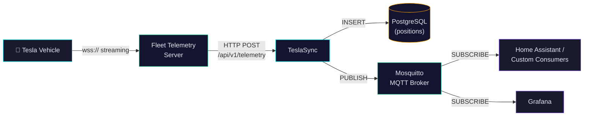
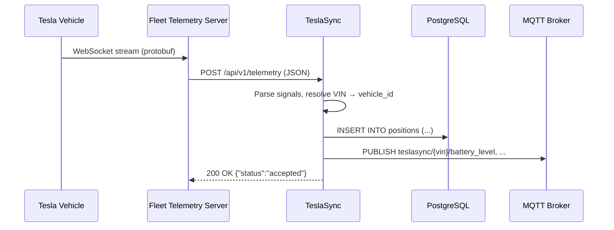

# Fleet Telemetry

This guide covers Tesla Fleet Telemetry — a streaming alternative to polling that delivers **near real-time** vehicle data at a fraction of the cost. By the end you'll have Fleet Telemetry configured, data flowing into TeslaSync, and MQTT topics available for home-automation consumers.

## Why Fleet Telemetry?

| Feature | Polling (default) | Fleet Telemetry |
|---|---|---|
| Data resolution | 15–30 s | **~1 s** |
| API cost (per vehicle/month) | ~$15–25 | **~$0.50** |
| Latency | Poll-interval dependent | **Near real-time** |
| Wake-up required | Yes | No (streams when online) |
| Setup complexity | Low | Medium |

### Cost Comparison

With standard polling TeslaSync makes thousands of Fleet API requests per month per vehicle. Tesla charges ~$0.00222 per request, so a single vehicle can cost **$15–25/month** depending on driving habits.

Fleet Telemetry replaces most of those requests with a single persistent WebSocket connection. You still need a handful of API calls for commands and initial setup, but data ingestion is essentially **free** — reducing costs by up to **97%**.

| Scenario | Polling Cost | Telemetry Cost | Savings |
|---|---|---|---|
| 1 vehicle, casual driver | ~$15/mo | ~$0.50/mo | **97%** |
| 1 vehicle, heavy driver | ~$25/mo | ~$0.50/mo | **98%** |
| 10-vehicle fleet | ~$200/mo | ~$5/mo | **97.5%** |

## Architecture

The Fleet Telemetry server is a separate process that Tesla's vehicles connect to over a persistent `wss://` connection. TeslaSync ingests the telemetry stream via an HTTP endpoint and publishes it onward to MQTT for downstream consumers.



### Data Flow



### Signal Coverage

TeslaSync achieves **100% Tesla Fleet Telemetry Protocol coverage** — all 230 signals from Tesla's `vehicle_data.proto` are subscribed, processed, and persisted:

| Category | Signals | Examples |
|----------|---------|---------|
| **Vehicle State** | 22 | Odometer, Gear, VehicleSpeed, Locked, SentryMode, doors, windows |
| **Vehicle Config** | 14 | TrimBadging, ExteriorColor, WheelType, RoofColor, SeatType |
| **Powertrain** | ~35 | Motor torque/RPM/temp (front/rear/REL/RER), pedal position, regen |
| **Climate** | 29 | InsideTemp, OutsideTemp, HvacPower, seat heaters (5 pos), defrost |
| **Security** | ~15 | Locked, SentryMode, doors, windows, lights, valet mode |
| **Safety** | 14 | ForwardCollisionWarning, AutomaticBlindSpotCamera, SpeedLimitWarning |
| **Charging** | ~30 | BatteryLevel, ChargeState, ChargerPower, pack voltage/current, BMS |
| **TPMS** | 11 | Tire pressure (FL/FR/RL/RR), temperature, timestamp |
| **Software** | 5 | SoftwareUpdate, VersionAvailable, ExpectedDuration |
| **User Preferences** | 5 | DistanceUnit, TemperatureUnit, ChargeUnit, 24HourTime |

All 229/230 signals are persisted to the `vehicle_live_state` table (158 columns added in migration 035). The remaining signal (Location) is stored as separate lat/lon columns from a JSON payload.

### Signal Processing Pipeline

```
ProcessSignals()
  ├─ normalizeFleetUnits()      — mph→km/h, miles→km
  ├─ SignalStore.Update()       — in-memory (nanosecond reads, always complete)
  ├─ signalLogger.Write()       — MongoDB signal_log (every signal, forever)
  ├─ liveState.Flush()          — Postgres vehicle_live_state (every 5s, 229 columns)
  ├─ extractPosition()          — Postgres positions (every 10s)
  ├─ sessionTracker             — drives + charge sessions (gear-based + speed fallback)
  ├─ trackStateTransition()     — 5-state machine (gear-based, stale freshness, orphan guard)
  ├─ evaluateCEPRules()         — CEP condition trees → alerts + SSE + notification dispatch
  └─ track*() snapshots         — 15 domain tables (every 10s)
```

### Signal Catalog

A frontend Signal Catalog (`web/src/lib/signalCatalog.ts`) provides metadata for all 230 signals:
- **Name** — Tesla signal name (e.g., `BatteryLevel`)
- **Category** — Grouping (Battery, Climate, Driving, etc.)
- **Type** — Data type (`number`, `string`, `boolean`, `enum`)
- **Unit** — Measurement unit (`%`, `km/h`, `°C`, etc.)
- **Description** — Human-readable explanation

The catalog powers the Alert Studio signal picker and the Diagnostics Signal Explorer.

## Prerequisites

| Requirement | Details |
|---|---|
| **Tesla Developer account** | With Fleet Telemetry access enabled |
| **Domain + TLS certificate** | Vehicles connect via `wss://` — self-signed certs will **not** work |
| **Public server** | Reachable from the internet (or via Tesla's proxy) |
| **TeslaSync** | Running instance with PostgreSQL ([Getting Started](/guide/getting-started)) |
| **Docker** | Recommended for deploying the telemetry server |
| **Public key** | ECDSA P-256 key hosted at `/.well-known/appspecific/com.tesla.3p.public-key.pem` |

::: warning
Tesla vehicles **only** connect to endpoints with valid TLS certificates signed by a public CA. Let's Encrypt is a free option that works well.
:::

## Public Key Setup

Tesla requires an ECDSA P-256 public key hosted at a well-known URL on your domain. TeslaSync handles this automatically.

### Using Developer Tools (Recommended)

1. Navigate to **Dev Tools** in the sidebar
2. Click **Generate Keypair** in the Public Key Setup section
3. **Save the private key immediately** — it's shown once and never stored
4. The public key is automatically stored and served at:
   ```
   https://your-domain/.well-known/appspecific/com.tesla.3p.public-key.pem
   ```
5. Click **Test** to verify the key is accessible

### Manual Setup

Generate a keypair with OpenSSL:

```bash
openssl ecparam -name prime256v1 -genkey -noout -out private-key.pem
openssl ec -in private-key.pem -pubout -out public-key.pem
```

Then upload `public-key.pem` via the Dev Tools UI, or paste the PEM content in the upload form.

### Verification

After setup, verify the key is served correctly:

```bash
curl https://your-domain/.well-known/appspecific/com.tesla.3p.public-key.pem
```

You should see a PEM-encoded public key starting with `-----BEGIN PUBLIC KEY-----`.

## Setup Guide

### Step 1 — Deploy the Fleet Telemetry Server

Clone and build the official Tesla Fleet Telemetry server:

```bash
git clone https://github.com/teslamotors/fleet-telemetry.git
cd fleet-telemetry
go build -o fleet-telemetry ./cmd/...
```

Or run with Docker:

```bash
docker run -d \
  --name fleet-telemetry \
  -p 443:443 \
  -v $(pwd)/config.json:/etc/fleet-telemetry/config.json \
  -v $(pwd)/certs:/certs \
  tesla/fleet-telemetry:latest
```

Create a `config.json` pointing to TeslaSync as the data consumer:

```json
{
  "host": "0.0.0.0",
  "port": 443,
  "log_level": "info",
  "tls": {
    "server_cert": "/certs/fullchain.pem",
    "server_key": "/certs/privkey.pem"
  },
  "records": {
    "V": {
      "dispatcher": {
        "type": "http",
        "url": "http://teslasync:8080/api/v1/telemetry"
      }
    }
  }
}
```

::: tip
The `records.V.dispatcher.url` should point to your TeslaSync instance's telemetry ingestion endpoint. If both services are on the same Docker network, use the container name (e.g., `http://teslasync:8080`).
:::

::: warning
As of v0.7.0, the Fleet Telemetry server should use the **MQTT dispatcher** (not HTTP). The `config.json` above shows the legacy HTTP dispatcher for reference. See the updated configuration below for the recommended MQTT-based setup.
:::

### Step 2 — Configure Your Tesla Developer Account

1. Log in to [developer.tesla.com](https://developer.tesla.com)
2. Navigate to your application settings
3. Add your telemetry server's public hostname as the **Fleet Telemetry endpoint**
4. Ensure the endpoint uses `wss://` with a valid TLS certificate

### Step 3 — Pair Vehicles

Each vehicle must be registered for telemetry via the Tesla Fleet API. Send a `fleet_telemetry_config` request for each VIN:

```bash
curl -X POST \
  "https://fleet-api.prd.na.vn.cloud.tesla.com/api/1/vehicles/{vehicle_id}/fleet_telemetry_config" \
  -H "Authorization: Bearer $TESLA_TOKEN" \
  -H "Content-Type: application/json" \
  -d '{
    "vins": ["YOUR_VIN"],
    "config": {
      "hostname": "telemetry.example.com",
      "port": 443,
      "ca": "-----BEGIN CERTIFICATE-----\n...\n-----END CERTIFICATE-----",
      "fields": {
        "VehicleSpeed": { "interval_seconds": 1 },
        "Latitude":     { "interval_seconds": 1 },
        "Longitude":    { "interval_seconds": 1 },
        "BatteryLevel": { "interval_seconds": 10 },
        "ChargeState":  { "interval_seconds": 10 },
        "InsideTemp":   { "interval_seconds": 30 },
        "OutsideTemp":  { "interval_seconds": 30 },
        "Odometer":     { "interval_seconds": 60 }
      }
    }
  }'
```

::: info
The `ca` field is your server's CA certificate in PEM format. For Let's Encrypt, use the ISRG Root X1 certificate.
:::

#### Regional API Endpoints

| Region | Base URL |
|---|---|
| North America, Asia-Pacific | `https://fleet-api.prd.na.vn.cloud.tesla.com` |
| Europe, Middle East, Africa | `https://fleet-api.prd.eu.vn.cloud.tesla.com` |
| China | `https://fleet-api.prd.cn.vn.cloud.tesla.cn` |

### Step 4 — Configure TeslaSync

Enable streaming in your TeslaSync environment configuration:

```bash
# .env
WORKER_STREAMING=true
```

The telemetry HTTP endpoint (`POST /api/v1/telemetry`) is enabled by default. When the Fleet Telemetry server sends data, TeslaSync automatically:

1. Parses the incoming signal payload
2. Resolves the VIN to an internal `vehicle_id`
3. Inserts a `positions` record into PostgreSQL
4. Publishes each metric to MQTT (if enabled)

See the [Configuration](/guide/configuration) page for all worker and MQTT environment variables.

### Step 5 — Verify

Once a vehicle is online and paired, data should begin streaming within seconds.

```bash
# Check telemetry endpoint status
curl http://localhost:8080/api/v1/telemetry

# Watch MQTT messages arrive in real-time
mosquitto_sub -h localhost -t 'teslasync/+/+' -v
```

You should see output like:

```
teslasync/5YJ3E1EA1LF000001/battery_level 85
teslasync/5YJ3E1EA1LF000001/latitude 37.774900
teslasync/5YJ3E1EA1LF000001/speed 65
teslasync/5YJ3E1EA1LF000001/inside_temp 21.5
```

Check the TeslaSync dashboard for real-time updates with 1-second resolution.

## Telemetry Ingest Endpoint

TeslaSync exposes `POST /api/v1/telemetry` to receive data from the Fleet Telemetry server. You can also use it to push data from custom sources.

### Request Format

```json
{
  "vin": "5YJ3E1EA1LF000001",
  "created_at": "2024-01-15T10:30:00Z",
  "data": {},
  "signals": [
    { "name": "Latitude",     "value": 37.7749,  "timestamp": "..." },
    { "name": "Longitude",    "value": -122.4194, "timestamp": "..." },
    { "name": "VehicleSpeed", "value": 65.5,      "timestamp": "..." },
    { "name": "PackPower",    "value": -15.2,     "timestamp": "..." },
    { "name": "BatteryLevel", "value": 85,        "timestamp": "..." },
    { "name": "InsideTemp",   "value": 21.5,      "timestamp": "..." },
    { "name": "OutsideTemp",  "value": 18.2,      "timestamp": "..." }
  ]
}
```

### Response

```json
{
  "status": "accepted",
  "signals": 7,
  "vin": "5YJ3E1EA1LF000001"
}
```

### Supported Signals

TeslaSync supports **228 Tesla fleet telemetry fields** — 100% coverage of all available signals. Signals are organized across the following categories:

| Category | Signal Count | Examples |
|---|---|---|
| Location & Navigation | ~15 | DestinationLocation, RouteLastUpdated, HomeLink nearby |
| Battery & Energy | ~25 | PackVoltage, PackCurrent, BmsFullchargecomplete, ModuleTemp* |
| Charging | ~55 | ACChargingPower, DCChargingPower, SuperchargerState, cell voltages |
| Climate & Comfort | ~30 | SeatHeater*, SteeringWheelHeat, AutoSeatClimateLeft/Right |
| Motor & Drivetrain | ~30 | DITorque*, DIAxleSpeed*, DIStatorTemp*, DIHeatsinkTemp* |
| Security & Access | ~20 | Locked, SentryMode, DoorState, TonneauState, SeatBelt* |
| Vehicle Config | ~15 | TrimBadging, ExteriorColor, RoofColor, SpoilerType |
| Safety & ADAS | ~15 | ForwardCollisionWarning, LaneDepartureAvoidance, FSD miles |
| Media | ~10 | MediaPlaybackStatus, MediaVolume, MediaSource |
| User Preferences | ~10 | DistanceUnit, TemperatureUnit, 24HourClock |
| General | ~3 | VehicleSpeed, Odometer, GuestMode |

## MQTT Integration

When MQTT is enabled, every telemetry data point is published to the Mosquitto broker included in the Docker Compose stack. This enables real-time integrations with Home Assistant, Grafana, Node-RED, and other consumers.

### Configuration

```bash
# .env
MQTT_ENABLED=true
MQTT_HOST=localhost      # Broker hostname
MQTT_PORT=1883           # Broker port
MQTT_USERNAME=           # Optional authentication
MQTT_PASSWORD=           # Optional authentication
MQTT_CLIENT_ID=teslasync # Client identifier
MQTT_PREFIX=teslasync    # Topic prefix
```

### Topic Structure

All topics follow the pattern: `{prefix}/{vin}/{metric}`

| Topic | Value | Example |
|---|---|---|
| `teslasync/{vin}/battery_level` | SOC % | `85` |
| `teslasync/{vin}/battery_range` | Estimated range | `248.3` |
| `teslasync/{vin}/charging_state` | Charging status | `Disconnected` |
| `teslasync/{vin}/latitude` | GPS latitude | `37.774900` |
| `teslasync/{vin}/longitude` | GPS longitude | `-122.419400` |
| `teslasync/{vin}/heading` | Compass bearing | `270` |
| `teslasync/{vin}/speed` | Current speed | `65` |
| `teslasync/{vin}/power` | Power draw (kW) | `-15` |
| `teslasync/{vin}/inside_temp` | Cabin temp (°C) | `21.5` |
| `teslasync/{vin}/outside_temp` | Ambient temp (°C) | `18.2` |
| `teslasync/{vin}/is_climate_on` | Climate active | `true` |
| `teslasync/{vin}/odometer` | Odometer reading | `42350.8` |
| `teslasync/{vin}/locked` | Door locked | `true` |
| `teslasync/{vin}/sentry_mode` | Sentry active | `false` |
| `teslasync/{vin}/software_update/version` | SW version | `2024.8.9` |
| `teslasync/{vin}/vehicle_data` | Full JSON payload | `{...}` |

### Subscribing

```bash
# All vehicles, all metrics
mosquitto_sub -h localhost -t 'teslasync/+/+' -v

# Single vehicle
mosquitto_sub -h localhost -t 'teslasync/5YJ3E1EA1LF000001/+' -v

# Specific metric across all vehicles
mosquitto_sub -h localhost -t 'teslasync/+/battery_level' -v

# Full JSON payload
mosquitto_sub -h localhost -t 'teslasync/+/vehicle_data'
```

### Home Assistant Example

Add MQTT sensors to your Home Assistant `configuration.yaml`:

```yaml
mqtt:
  sensor:
    - name: "Tesla Battery"
      state_topic: "teslasync/YOUR_VIN/battery_level"
      unit_of_measurement: "%"
      device_class: battery

    - name: "Tesla Speed"
      state_topic: "teslasync/YOUR_VIN/speed"
      unit_of_measurement: "km/h"
      icon: mdi:speedometer

    - name: "Tesla Cabin Temp"
      state_topic: "teslasync/YOUR_VIN/inside_temp"
      unit_of_measurement: "°C"
      device_class: temperature

  binary_sensor:
    - name: "Tesla Locked"
      state_topic: "teslasync/YOUR_VIN/locked"
      payload_on: "true"
      payload_off: "false"
      device_class: lock
```

## Data Storage & Retention

Telemetry data is stored in the `positions` table, which is **partitioned by time** for efficient querying and automatic cleanup.

### Schema

| Column | Type | Description |
|---|---|---|
| `id` | BIGSERIAL | Auto-incrementing ID |
| `vehicle_id` | BIGINT | Foreign key to `vehicles` |
| `latitude` | DOUBLE PRECISION | GPS latitude |
| `longitude` | DOUBLE PRECISION | GPS longitude |
| `speed` | DOUBLE PRECISION | Speed (nullable) |
| `power` | DOUBLE PRECISION | Power draw (nullable) |
| `heading` | INTEGER | Compass heading (nullable) |
| `elevation` | DOUBLE PRECISION | Altitude (nullable) |
| `odometer` | DOUBLE PRECISION | Odometer reading |
| `ideal_range` | DOUBLE PRECISION | Ideal range estimate |
| `rated_range` | DOUBLE PRECISION | Rated range estimate |
| `battery_level` | INTEGER | Battery SOC % |
| `inside_temp` | DOUBLE PRECISION | Cabin temperature |
| `outside_temp` | DOUBLE PRECISION | Ambient temperature |
| `fan_status` | INTEGER | HVAC fan level |
| `is_climate_on` | BOOLEAN | Climate active |
| `created_at` | TIMESTAMPTZ | Record timestamp |

### Retention Policy

```bash
# .env
POSITION_RETENTION_DAYS=90   # Position/telemetry records
DATA_RETENTION_DAYS=365      # General data (drives, charges)
```

The maintenance worker runs daily to:
1. Delete position records older than the retention period
2. Create new time-based partitions for upcoming months
3. Clean up stale drive and charging session records
4. Update database statistics (ANALYZE)

::: warning
With 1-second telemetry resolution a single vehicle generates **~2.6 million** position records per month (~500 MB). Plan your storage accordingly and adjust `POSITION_RETENTION_DAYS` for your needs.
:::

### Estimated Storage

| Vehicles | Retention | Approx. Storage |
|---|---|---|
| 1 | 90 days | ~1.5 GB |
| 10 | 90 days | ~15 GB |
| 100 | 90 days | ~150 GB |
| 1 | 365 days | ~6 GB |

## Security Considerations

::: warning
Review these settings before deploying to production.
:::

### Telemetry Endpoint Authentication

The `POST /api/v1/telemetry` endpoint currently does **not** require authentication. In production, restrict access using one of:

- **Network-level isolation** — Place the Fleet Telemetry server and TeslaSync on the same private network
- **Reverse proxy** — Use Nginx/Caddy to add IP allowlisting or mTLS in front of the endpoint
- **API keys** — TeslaSync's API key system (when fully enabled) supports `read-write` and `admin` permission levels

::: tip
The `/.well-known/appspecific/com.tesla.3p.public-key.pem` path must **bypass** any authentication middleware (e.g., Authentik, Authelia). Tesla's servers need to fetch this key without credentials.
:::

### MQTT Broker

The default `mosquitto.conf` allows anonymous access:

```
allow_anonymous true
```

For production, enable authentication:

```
allow_anonymous false
password_file /mosquitto/config/passwd
```

Generate a password file:

```bash
mosquitto_passwd -c /mosquitto/config/passwd teslasync
```

### TLS for MQTT

Add TLS to protect MQTT traffic:

```
listener 8883
cafile /mosquitto/certs/ca.crt
certfile /mosquitto/certs/server.crt
keyfile /mosquitto/certs/server.key
```

## Polling vs. Telemetry — Hybrid Mode

You don't have to choose one or the other. TeslaSync supports running **both** simultaneously:

- **Fleet Telemetry** delivers high-resolution data when the vehicle is online
- **Polling** acts as a fallback and handles commands, wake-ups, and metadata not covered by telemetry

```bash
# .env — Hybrid mode
WORKER_STREAMING=true
WORKER_POLL_INTERVAL=60s       # Reduce polling frequency
WORKER_SLEEP_POLL_MULT=4       # 240s when asleep
```

::: tip
In hybrid mode, increase `WORKER_POLL_INTERVAL` to reduce API costs while keeping telemetry for real-time data. Polling at 60 s instead of 15 s cuts API costs by **75%**.
:::

## Fleet Telemetry Status in UI

TeslaSync v0.4.0 adds Fleet Telemetry visibility to the **System Status** page.

### OAuth Scopes

Fleet Telemetry requires the following OAuth scopes for full signal coverage:

| Scope | Required For |
|---|---|
| `openid` | Authentication |
| `offline_access` | Token refresh |
| `vehicle_device_data` | Vehicle telemetry and state data |
| `vehicle_cmds` | Remote commands |
| `vehicle_charging_cmds` | Charging control |
| `vehicle_location` | Location telemetry fields (DestinationLocation, etc.) |

::: tip
If you added `vehicle_location` after initial authorization, use the **Re-authorize** button in Settings (which adds `prompt=consent`) to force Tesla to re-approve all scopes.
:::

### Status Card

The Fleet Telemetry card appears alongside other service cards (Database, Tesla API, MQTT, Redis). It shows:

- **Enabled** (green) — Displays endpoint, protocol, host:port, and supported signals
- **Disabled** (grey) — Shows setup hint with `FLEET_TELEMETRY_ENABLED=true` instruction

### Configuration

Set these environment variables to enable Fleet Telemetry monitoring:

```env
FLEET_TELEMETRY_ENABLED=true
FLEET_TELEMETRY_HOST=fleet-telemetry    # hostname of your fleet telemetry server
FLEET_TELEMETRY_PORT=4443               # port (default: 4443)
```

### API Call Logging

Fleet Telemetry ingests are automatically logged in the API call logs with `source: fleet_telemetry`, making it easy to distinguish from regular Tesla API calls (`source: tesla_api`) in the **API Logs** page.

## Troubleshooting

### Vehicle not connecting

**Symptom:** No data appears after pairing.

1. Ensure your TLS certificate is valid and issued by a **public CA** (not self-signed)
2. Verify DNS resolves correctly: `nslookup telemetry.example.com`
3. Check that the vehicle has been paired via the Fleet API (`fleet_telemetry_config`)
4. Vehicles only stream when **online** — a sleeping vehicle will not connect
5. Check the Fleet Telemetry server logs for connection attempts

### Data not appearing in TeslaSync

**Symptom:** Fleet Telemetry server shows connections, but TeslaSync dashboard is empty.

1. Verify the dispatcher URL in `config.json` points to TeslaSync's `/api/v1/telemetry` endpoint
2. Check TeslaSync logs for incoming telemetry payloads:
   ```bash
   docker compose logs teslasync | grep telemetry
   ```
3. Test the endpoint manually:
   ```bash
   curl -X POST http://localhost:8080/api/v1/telemetry \
     -H "Content-Type: application/json" \
     -d '{"vin":"TEST_VIN","signals":[{"name":"Latitude","value":37.77}]}'
   ```
4. Ensure the VIN in the telemetry payload matches a vehicle registered in TeslaSync

### MQTT messages not publishing

**Symptom:** Data is in the database but MQTT topics are empty.

1. Verify MQTT is enabled: `MQTT_ENABLED=true` in `.env`
2. Check the Mosquitto broker is running:
   ```bash
   docker compose ps mosquitto
   ```
3. Test broker connectivity:
   ```bash
   mosquitto_pub -h localhost -t 'test' -m 'hello'
   mosquitto_sub -h localhost -t 'test' -C 1
   ```
4. Check TeslaSync logs for MQTT connection errors

### High latency

**Symptom:** Data arrives but with noticeable delay.

1. Fleet Telemetry should deliver **sub-second** latency
2. Check network conditions between the telemetry server and TeslaSync
3. Monitor PostgreSQL performance — slow INSERTs can cause backpressure
4. Consider reducing the number of signals or increasing their intervals

### High storage usage

**Symptom:** Database growing faster than expected.

1. Reduce `POSITION_RETENTION_DAYS` (default 90)
2. Increase telemetry field intervals (e.g., 5 s instead of 1 s for GPS)
3. Check that the maintenance worker is running:
   ```bash
   docker compose logs teslasync | grep maintenance
   ```

## Integrated Fleet Telemetry Server

TeslaSync includes the official Tesla Fleet Telemetry server as an **optional service** in both Docker Compose and Helm.

### Docker Compose

Enable the Fleet Telemetry server using Docker Compose profiles:

```bash
# Start with fleet telemetry enabled
docker compose --profile telemetry up -d

# Start without fleet telemetry (default)
docker compose up -d
```

Before starting, ensure you have:
1. A valid TLS certificate and key in `./certs/`
2. Updated `fleet-telemetry-config.json` with your settings

The config file is pre-configured to relay telemetry data to `teslasync-api:8080/api/v1/telemetry`.

### Helm Chart

Enable in your `values.yaml`:

```yaml
fleetTelemetry:
  enabled: true
  image: tesla/fleet-telemetry:latest
  service:
    type: ClusterIP
    port: 4443
  tls:
    secretName: fleet-telemetry-tls  # K8s TLS secret
```

Create the TLS secret:

```bash
kubectl create secret tls fleet-telemetry-tls \
  --cert=fullchain.pem \
  --key=privkey.pem \
  -n teslasync
```

The Helm chart automatically configures the Fleet Telemetry server to forward data to the TeslaSync API service.

## Next Steps

- [Configuration](/guide/configuration) — Full reference for all environment variables
- [Architecture](/guide/architecture) — Database schema and system design details
- [Getting Started](/guide/getting-started) — Initial TeslaSync setup if you haven't done so
- [Troubleshooting](/guide/troubleshooting) — General troubleshooting beyond telemetry
