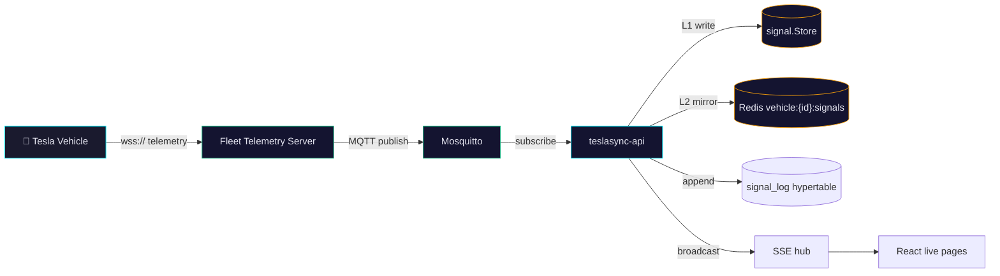
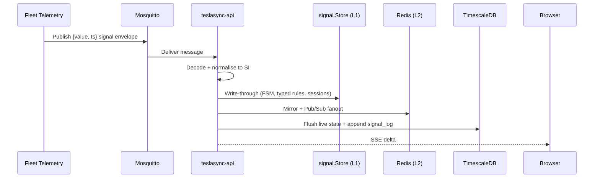

# Fleet Telemetry

Tesla Fleet Telemetry is TeslaSync's preferred high-frequency data path. It streams vehicle signals over WSS into a Tesla-provided server, which republishes them through MQTT for TeslaSync to ingest. It supplements rather than replaces Tesla Fleet API polling.

## Why use it

| Capability             | Polling                       | Fleet Telemetry                                |
| ---------------------- | ----------------------------- | ---------------------------------------------- |
| Latency                | Poll-interval bound           | Near real-time while the vehicle streams       |
| API usage              | Higher                        | Lower for state changes                        |
| Vehicle wake behaviour | May require wake/refresh      | Streams when the vehicle is online + configured|
| Setup                  | Simple                        | Requires public TLS endpoint + Tesla setup     |

## Architecture



## Signal pipeline



## Required production pieces

::: warning Virtual-key pairing is required for telemetry setup
Tesla's [official Fleet Telemetry setup sequence](https://github.com/teslamotors/fleet-telemetry#setup-steps)
requires application registration, pairing the application's virtual key to the
vehicle, and a Vehicle Command Proxy using the matching private key before
submitting `fleet_telemetry_config`. Virtual keys are **not only for remote controls**.
Check Tesla's [vehicle compatibility guidance](https://github.com/teslamotors/fleet-telemetry#vehicle-compatibility)
for current firmware and model restrictions; not every vehicle or signal is supported.
:::

Keep the application signing key distinct from the receiver's TLS certificate.
The public-key URL must be accessible without login. Vehicle connections use
mutual TLS: terminate mTLS at the Fleet Telemetry receiver, not an ordinary
web reverse proxy. Tesla's upstream `check_server_cert.sh` validates the public
receiver configuration before you submit it.

| Requirement                  | Notes                                                                              |
| ---------------------------- | ---------------------------------------------------------------------------------- |
| Tesla Developer account      | Fleet Telemetry must be enabled on your app / account                              |
| Public HTTPS/WSS endpoint    | Vehicles require a publicly trusted TLS certificate                                |
| Tesla public-key URL         | Serve `/.well-known/appspecific/com.tesla.3p.public-key.pem` unauthenticated       |
| MQTT broker                  | Compose and Helm include Mosquitto by default                                      |
| Event-time producer image    | Use TeslaSync's Fleet Telemetry image; Tesla's stock MQTT output drops `CreatedAt` |
| API config                   | Set `FLEET_TELEMETRY_*` envs (see [Configuration](/guide/configuration))           |

## Docker Compose

Fleet Telemetry is optional and runs under the `telemetry` profile:

```bash
docker compose --profile telemetry up -d --build
```

Configure the public host, TLS certificates, topic base, and Tesla Developer
settings in `.env` and the repository-root `fleet-telemetry-config.json` before
enabling it. Compose mounts that file at `/etc/fleet-telemetry/config.json`.
The receiver publishes host port `FLEET_TELEMETRY_PORT` (default `4443`) to
container port `4443`. Keep the advertised port, firewall, and receiver consistent.

Set `FLEET_TELEMETRY_ENABLED=true` and the public `FLEET_TELEMETRY_HOST`.
Configure the `commands` profile and
[API environment overrides](/deployment/docker#required-environment-overrides)
for signing; starting either profile alone does not configure the vehicle.

### Subscribe and verify

1. Complete [Fleet API registration](/guide/tesla-fleet-api) and virtual-key pairing.
2. Deploy and validate the reachable receiver and matching signing proxy.
3. Open **Settings → Fleet Setup** (`/settings/fleet-setup`), connect your account,
   select the vehicle, and choose signals and intervals before submitting.
4. Wait for Tesla's configuration to report `synced: true`. Submission success
   alone does not prove the vehicle accepted the configuration.
5. While the vehicle is online, confirm fresh signal timestamps in TeslaSync.
   Review Fleet Setup's Tesla-reported errors and receiver/API logs if data is absent.

Tesla sends configured signals on change, no more frequently than their minimum
interval. A quiet signal or sleeping vehicle is not proof of a broken receiver.
See [Troubleshooting](/guide/troubleshooting) for the next checks.

TeslaSync ships a pinned Fleet Telemetry build that keeps the upstream
`Payload.CreatedAt` value in every per-field MQTT payload. Do not replace it
with `tesla/fleet-telemetry` unless that upstream image gains the same
`{"value": ..., "ts": ...}` contract; the stock image currently publishes
bare values and queued messages would otherwise be timestamped when replayed.

For the first event-time cutover, deploy the TeslaSync Fleet Telemetry image
**before** the strict API consumer. Do not rely on a simultaneous Helm upgrade:
Kubernetes does not guarantee which Deployment becomes ready first.

1. Update only the Fleet Telemetry Deployment to
   `ghcr.io/ev-dev-labs/teslasync-fleet-telemetry:<version>`.
2. Wait for its rollout and inspect a canary MQTT message; its body must contain
   both `value` and an RFC3339Nano `ts`.
3. Upgrade the Helm release so the API begins enforcing source timestamps, then
   confirm `teslasync_mqtt_telemetry_event_time_total{outcome="source"}`
   increases while the `rejected_missing` and `rejected_invalid` outcomes stay
   flat.

After the API upgrade, valid signals without `ts` are sent to the MQTT DLQ and
acknowledged rather than written with receipt time. Any bare messages already
queued by the stock producer are intentionally quarantined because MQTT 3.1.1
contains no timestamp from which their original event time can be recovered.
External Fleet Telemetry producers must emit the same envelope contract.

## Kubernetes

Use Helm values for Fleet Telemetry and the ingress/TLS. The web route must allow `/.well-known` without app auth so Tesla can fetch the public key.

```yaml
fleetTelemetry:
  enabled: true
  host: telemetry.example.com
  port: 4443
  topicBase: "telemetry"

config:
  apiEndpoint: "http://teslasync-api.teslasync.svc.cluster.local:8080"
```

Check `helm/teslasync/values.yaml` for TLS, resources, and external Fleet Telemetry options before applying.

## Public-key verification

```bash
curl https://your-domain/.well-known/appspecific/com.tesla.3p.public-key.pem
```

The response must be a PEM public key, served unauthenticated. Keep the private key secret.

## Diagnostics

The platform exposes Tesla's Fleet Telemetry errors directly:

| Endpoint                                              | Purpose                                |
| ----------------------------------------------------- | -------------------------------------- |
| `GET /api/v1/tesla/fleet-telemetry/errors`            | Recent stream errors per vehicle       |
| `GET /api/v1/tesla/fleet-telemetry/error-vins`        | VINs currently reporting telemetry errors |

The web UI surfaces these in **System → Telemetry pipeline** and on the per-vehicle diagnostics page.

## Troubleshooting

| Symptom                       | Check                                                                          |
| ----------------------------- | ------------------------------------------------------------------------------ |
| Tesla cannot verify domain    | `/.well-known` route bypasses app auth and returns the PEM key                 |
| No telemetry arrives          | Mosquitto reachable, topic base matches config, Fleet Telemetry server logs    |
| Live UI stale                 | L1 store updating, Redis L2 mirroring, `signal_log` appending, SSE connected    |
| Polling still active          | Expected for setup, refresh, commands, and stale-stream fallback               |
