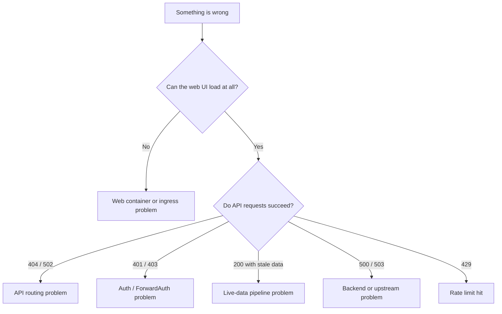

# Troubleshooting

When something in TeslaSync isn't behaving, walk through the relevant section here before digging into source. Most issues fall into a small number of patterns and the symptom-to-cause map is short.

## The triage tree

Start at the top and follow the branch that matches what you see:



The rest of this page is the per-branch playbook.

## Web UI won't load

| Check                                                         | Where                                                       |
| ------------------------------------------------------------- | ----------------------------------------------------------- |
| Is the web container up?                                      | `docker compose ps web` / `kubectl get pods -l app=web`     |
| Are there startup errors in the web log?                      | `docker compose logs web` / `kubectl logs deployment/web`   |
| Does the container respond to `curl localhost:3000`?          | From the host the container runs on                         |
| Is the ingress / reverse proxy passing through to the web service? | Your ingress controller's logs                          |
| Did a recent deploy break the build?                          | Check the most recent CI run for the deployed tag           |

The web container is Nginx + the React bundle. If Nginx is responding but pages 404, the React build artefacts didn't land — the container image is broken; rebuild.

## API calls fail with 404

The most common cause is a **doubled `/api/v1` prefix**:

- Bad: hook calls `request('/api/v1/vehicles')` → produces `/api/v1/api/v1/vehicles` → 404
- Good: hook calls `request('/vehicles')` — the request client adds `/api/v1`

Search your local change for any new hook that includes the prefix:

```bash
grep -rn "/api/v1/" web/src/api/hooks/
```

For Kubernetes deployments where API calls go straight through Nginx without `/api` rewriting:

```yaml
config:
  apiEndpoint: "http://teslasync-api.<namespace>.svc.cluster.local:8080"
  browserApiBase: ""
```

Empty `browserApiBase` keeps the browser on the same origin as the web UI; Nginx in the web container proxies `/api` to the internal API service.

## API calls fail with 401 / 403

The forward-auth header isn't reaching the API, or the user isn't authorised for the resource.

| Symptom                                              | Likely cause                                                    | Fix                                                                 |
| ---------------------------------------------------- | --------------------------------------------------------------- | ------------------------------------------------------------------- |
| Every request returns 401 with code `MISSING_IDENTITY` | `FORWARD_AUTH_HEADER` is set but no proxy is injecting that header on this request | Confirm the proxy is in the request path; check the proxy injects the exact header name (Authentik: `X-Authentik-Username`, Authelia: `Remote-User`, oauth2-proxy: `X-Auth-Request-User`, custom: `X-Forwarded-User`) |
| Specific endpoints return 501 with code `AUTH_MODE_OPEN` | API is in open mode (`FORWARD_AUTH_HEADER` unset) but the endpoint requires an identity | Set `FORWARD_AUTH_HEADER` and put a forward-auth proxy in front; see [Getting Started Step 3](/guide/getting-started#step-3-decide-on-the-authentication-model) |
| OAuth callback loops back to the login screen        | `TESLA_REDIRECT_URI` doesn't match what's registered with Tesla | Update one of them to match exactly (scheme, host, port, path, no trailing slash mismatch) |
| OAuth completes but every Fleet API call returns `invalid_scope` | Tesla Developer application is missing one of the five required scopes | Re-tick all five (`openid`, `offline_access`, `vehicle_device_data`, `vehicle_location`, `vehicle_cmds`, `vehicle_charging_cmds`) in the developer portal and re-run **Connect Tesla** |
| OAuth completes but `/api/1/vehicles` returns 404    | `TESLA_API_BASE_URL` points at a different region than the Tesla account | Match the base to the user's region (NA/EU/CN — see [regions](/guide/tesla-fleet-api#step-2-pick-a-region)) |
| Specific resource returns 403, others succeed        | User doesn't own the resource                                   | Verify the user → resource ownership in the database               |
| TOTP step asks for a second code repeatedly          | Clock skew between server and authenticator                     | Sync server clock with NTP; TOTP windows are ±30s                  |
| API refuses to start with `ENCRYPTION_KEY is required in production` | `APP_ENV=production` (or `GO_ENV=production`) without `ENCRYPTION_KEY` set | Set the key (`openssl rand -base64 32`) or remove the production flag if running a non-production trial |

## Live data is stale

The freshest signal value moves through Fleet Telemetry → MQTT → API consumer → L1/L2 → SSE → browser. Walk the chain in that order:

1. **Fleet Telemetry server** — `docker compose logs fleet-telemetry` (or its Kubernetes equivalent). If it shows no inbound connections, Tesla is the one not sending — check the partner-key route and the Tesla Developer app's Fleet Telemetry config.
2. **MQTT broker** — `docker compose logs mosquitto`. If the broker isn't seeing publishes, the Fleet Telemetry → MQTT bridge is the issue.
3. **API consumer** — `docker compose logs teslasync-api | grep -i mqtt`. The consumer should log subscribe events at startup and per-message logs at debug level.
4. **L2 (Redis)** — `redis-cli HGETALL vehicle:<id>:signals`. If values are recent here, the API has them.
5. **SSE in the browser** — browser devtools → Network → filter on `EventStream`. Look for `/api/v1/events`. If it's not active or shows red, the SSE connection dropped and the frontend is on its polling fallback.
6. **Polling fallback** — if SSE is down the dashboard shows a "Polling" indicator. Data should still update, just slower.

If everything looks healthy but values are stale, check `signal_log` for recent rows:

```sql
SELECT vehicle_id, max(timestamp) FROM signal_log GROUP BY vehicle_id ORDER BY 2 DESC LIMIT 5;
```

Stale `signal_log` with healthy Redis is unusual but happens if the durable-write worker is back-pressured — look for elevated `signal_log_writer_lag_seconds` in Prometheus.

## API call returns 500 / 503

500 is a server bug; 503 is an upstream dependency failure. The log will tell you which:

```bash
docker compose logs teslasync-api | grep -i "error" | tail -50
```

Common 5xx causes:

| Code | Likely cause                                         | Where to look                                                        |
| ---- | ---------------------------------------------------- | -------------------------------------------------------------------- |
| 500  | Repository / SQL error                               | The log will show the wrapped error chain                            |
| 500  | Panic in a handler                                   | Stack trace in the log; should be fixed promptly                     |
| 503  | Tesla API unreachable                                | Check `https://status.tesla.com` and your egress firewall            |
| 503  | Database connection pool exhausted                   | `pg_stat_activity` count high; tune pool size or query slowness      |
| 503  | Redis unreachable                                    | Check Redis health; L2 falls back to L1 only, scaling becomes per-pod |

## API call returns 429

You're being rate-limited. Three places enforce limits:

| Surface                  | Source                                       | What to tune                                       |
| ------------------------ | -------------------------------------------- | -------------------------------------------------- |
| General API              | Per-IP middleware                            | Increase the IP-based budget if legitimate         |
| Tesla command endpoints  | Per-IP middleware (lower cap)                | Same                                               |
| Helix AI                 | `AI_RATE_LIMIT_PER_MIN` per user             | Raise the env var; observe `ai_call_log` for spend |
| Tesla upstream           | Tesla's own rate limits (returned as 429)    | You can't tune; back off and retry                 |

The error code in the JSON body distinguishes: `RATE_LIMITED` (us) vs `TESLA_API_RATE_LIMITED` (upstream).

## Remote command fails with "vehicle requires signed commands"

Newer vehicles need the **Vehicle Command Proxy**:

- Model 3 / Model Y from 2021+
- Model S / Model X refresh
- Cybertruck

Without the proxy, those vehicles can read state via the Fleet API but commands will fail. Set `TESLA_COMMAND_PROXY_URL` (or `commandProxy.enabled: true` in Helm) and ensure the proxy is reachable from the API service.

`wake_up` is intentionally **never** proxied — it always goes direct to Tesla. If the proxy is misconfigured, `wake_up` still works; everything else fails. That's a useful diagnostic.

## Helix AI feature returns 404 / shows a blank panel

The feature is off. Open **Settings → Helix** and toggle it on. The 404 is the expected off-state response from `g.Wrap(...)`; the frontend component returns `null` from `withAiFeature(...)`. The full reference for the contract is in [Helix AI](/guide/helix-ai).

## Helix AI hangs at "Helix is thinking…"

| Check                                                                                         | Where                                                       |
| --------------------------------------------------------------------------------------------- | ----------------------------------------------------------- |
| Active provider healthy?                                                                      | `curl /api/v1/ai/provider/health`                           |
| Most recent call's error?                                                                     | `SELECT * FROM ai_call_log ORDER BY id DESC LIMIT 5;`       |
| For Ollama: model pulled?                                                                     | `docker compose exec ollama ollama list`                    |
| For Ollama: GPU/CPU under heavy load?                                                         | `docker stats ollama`                                       |
| For Azure: deployment name + endpoint + key set?                                              | Env vars on the API + worker containers                     |
| For OpenAI / Anthropic: API key valid and not quota-exceeded?                                 | Provider's dashboard                                        |
| Daily budget reached?                                                                         | `SELECT sum(cost_usd) FROM ai_call_log WHERE ts >= date_trunc('day', now());` |

Helix never silently fails — the audit log records every call attempt, success or failure. If a call doesn't show up in `ai_call_log`, the request didn't reach the dispatcher (check rate limit, feature toggle, off-by-default contract).

## PWA shows stale content

The service worker cached an older shell.

```bash
# In production: deploy refreshes the worker; users get the new shell on next page load.
# To force-update in dev or after a stuck deploy:
#  - Browser devtools → Application → Service Workers → Unregister
#  - Hard reload (Ctrl+Shift+R / Cmd+Shift+R)
```

If you previously enabled `VITE_PWA_DEV=true` locally and now have stale dev behaviour, unregister the worker. The dev service worker should not be enabled outside short-lived test sessions.

## Partner registration fails

`POST /api/v1/devtools/register-partner` calls Tesla's `POST /api/1/partner_accounts`. The most common failure modes:

| Symptom                                                                | Likely cause                                                                                            | Fix                                                                                                  |
| ---------------------------------------------------------------------- | ------------------------------------------------------------------------------------------------------- | ---------------------------------------------------------------------------------------------------- |
| `412 Precondition Failed`                                              | Tesla cannot fetch `/.well-known/appspecific/com.tesla.3p.public-key.pem` on the registered domain      | Verify the route works anonymously over public HTTPS — no forward-auth, no self-signed cert         |
| `400` with `unauthorized_client`                                       | Developer application is not approved for Fleet Telemetry, or the app's region does not match the base | Check the portal application status; verify `TESLA_API_BASE_URL` matches the app's region            |
| `502 Bad Gateway` with `Failed to obtain partner token`                | `fleet-auth.prd.vn.cloud.tesla.com` rejected the `client_credentials` grant                             | Confirm `TESLA_CLIENT_ID` + `TESLA_CLIENT_SECRET` are correct and the app is approved                 |
| Tesla response includes HTML instead of JSON                           | Auth redirect or error page intercepted before reaching the partner endpoint                            | Re-check the base URL and partner-token flow in `internal/tesla/client_partner_devtools.go` logs     |

After a successful registration, verify with:

```bash
curl 'https://teslasync.example.com/api/v1/devtools/partner-public-key?domain=teslasync.example.com'
```

`verification.matches_local: true` confirms Tesla and the local install agree on the key. `matches_local: false` is the most common cause of Fleet Telemetry connection refusals — re-run registration to push the current local key to Tesla.

## Tesla public-key verification fails

`/.well-known/appspecific/com.tesla.3p.public-key.pem` must be reachable over **public HTTPS** with **no auth** and **valid TLS**. Common misconfigurations:

- Reverse proxy is intercepting `/.well-known` and serving 404 (Traefik / Nginx routing order)
- ForwardAuth middleware is applied to the well-known route and demands login
- Cert is self-signed or expired

In Traefik, give the well-known route higher priority than the catch-all auth route:

```yaml
- kind: Rule
  match: "Host(`teslasync.example.com`) && PathPrefix(`/.well-known`)"
  priority: 100
  services: [{name: teslasync-web, port: 80}]
- kind: Rule
  match: "Host(`teslasync.example.com`)"
  priority: 10
  middlewares: [{name: authentik-auth, namespace: authentik}]
  services: [{name: teslasync-web, port: 80}]
```

## Database migration is stuck

Migrations are append-only and run on API startup. If a migration fails mid-flight, `schema_migrations.dirty=true` blocks subsequent runs:

```sql
SELECT version, dirty FROM schema_migrations;
```

To recover:

1. Identify the failing migration (the version after the last cleanly-applied one).
2. Inspect what it does (`migrations/<version>_*.up.sql`).
3. Fix the underlying issue (missing extension, conflicting data, etc.).
4. Reset the dirty flag: `UPDATE schema_migrations SET dirty=false, version=<last_clean>`.
5. Restart the API — it'll re-attempt the migration.

Never edit a migration that's already been applied in any environment. Add a new migration that corrects the state.

## Frontend build errors

```bash
cd web
npm install
npx tsc --noEmit
npm run lint
npm test
npm run build
```

Most failures are:

- API response type drift (the backend response shape changed; update the TypeScript type)
- Missing null checks (the API now returns nullable for a field that used to be required)
- Direct chart/map library imports (use the shared barrels from `@/components/charts` and `@/components/maps`)
- Hardcoded units / dates (use `useUnits()` / `useFormatting()` / `useDateFormat()`)
- Inline styles in feature pages (use Tailwind + `@/components/ui`)

The pre-PR baseline is "all five commands pass". CI runs the same.

## Docs build errors

```bash
cd docs
npm install
npm run docs:build
```

The most common failures:

- Vue interpolation collisions — double-brace expressions in markdown, outside fenced code blocks, get parsed by Vue. Wrap the example in a fence or use prose instead. Internal-only docs that contain interpolation-like examples live in the `srcExclude` list in `docs/.vitepress/config.ts`.
- Mermaid diagram syntax errors — quote node labels that contain special characters; check fence types.
- Broken relative links — VitePress validates these at build time; fix the path or use an absolute `/foo/bar` link.

## Helm install renders but the app can't reach the API

`config.apiEndpoint` is for **Nginx** (an internal service DNS name); `config.browserApiBase` is for the **browser** (usually empty for same-origin). If you've swapped them, the API is unreachable. If you've removed the web container's `/api/` proxy block, the browser hits `/api` on the web service directly and Nginx 404s.

For same-origin deployments:

```yaml
config:
  apiEndpoint: "http://teslasync-api.<namespace>.svc.cluster.local:8080"
  browserApiBase: ""
```

For separate-origin (API on its own domain): set `browserApiBase` to the API's URL and configure CORS via `CORS_ORIGINS`.

## When the playbook doesn't help

The structured logs are the source of truth. Most issues are visible in the API log within a handful of lines. If you're stuck:

1. Grab the last 200 lines of the API log around the failure
2. Note the request ID from the response headers (`X-Request-Id`)
3. Search the log for that request ID — every log line emitted while processing the request will carry it
4. The error chain in the log shows the exact failure path, with context (which repo method, which SQL, which vehicle ID)

Open an issue with that triage attached and the response is usually fast.
